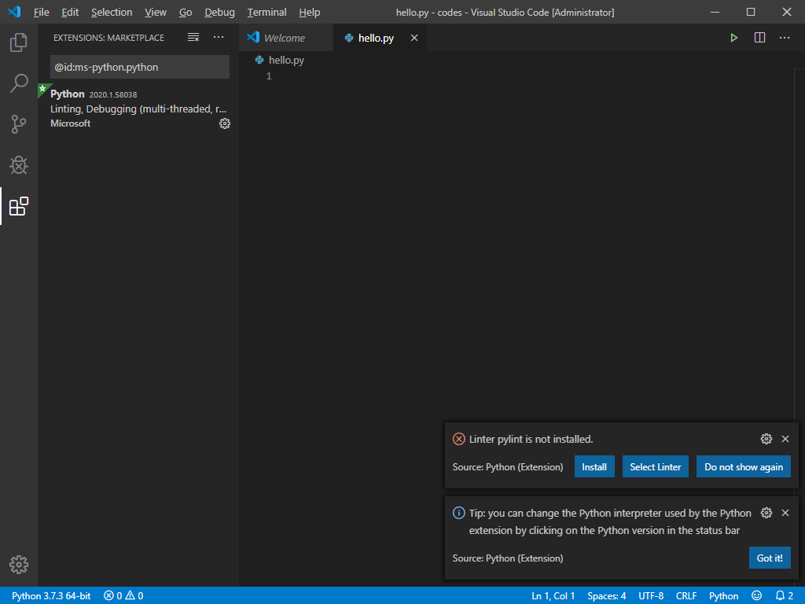
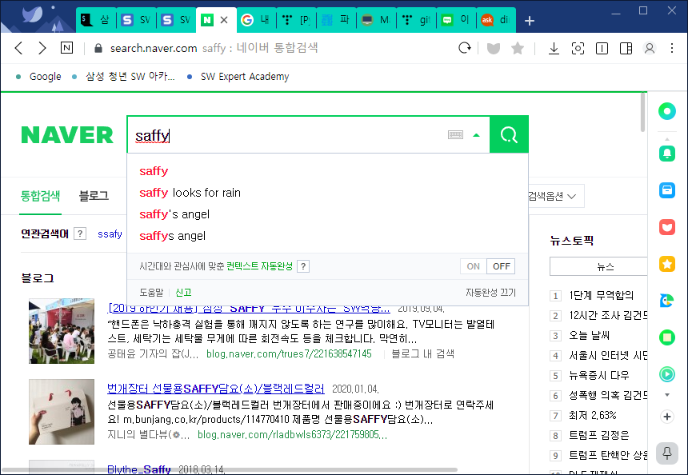
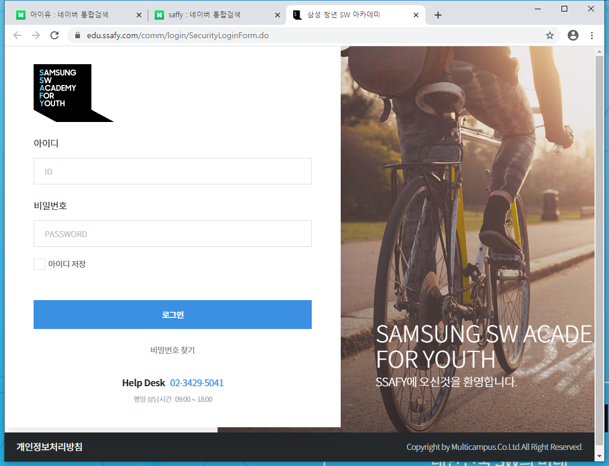
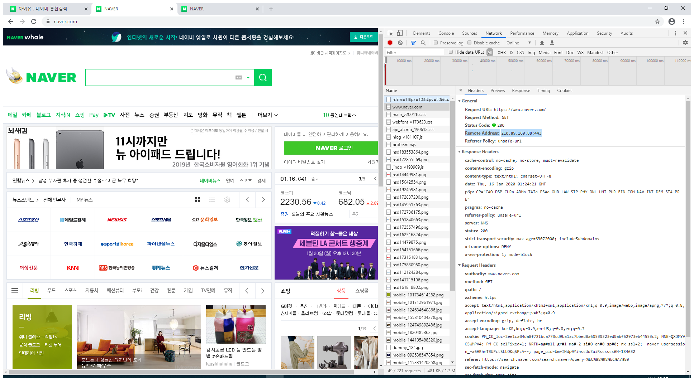
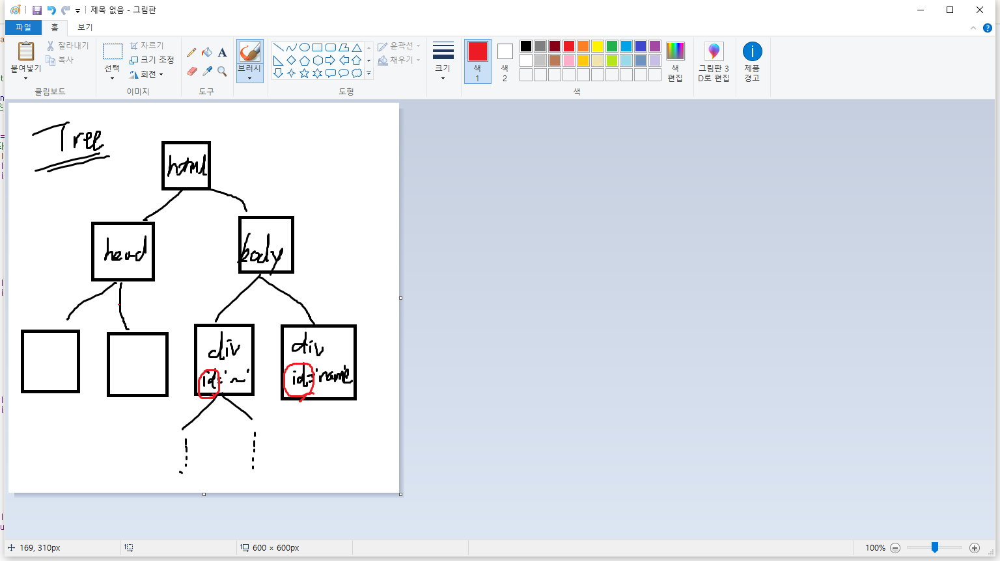

### 1/16 

# Life Hacking - Day2

* 어제차 복습
  * 프로그래밍 언어란? - 무언가를 컴퓨터에게 시키는 일
  * 그것을 통해 무엇을 원하는지...


## 1. 컴퓨터 조작

### 	1.1 - 윈도우 터미널(cmd) 조작하기

> 윈도우 터미널인 cmd는 조작하기에 많은 제한이 있고, 유저에게 친숙하지도 않다.
>
> 더 좋은 쉘을 다운받아서 사용할 예정이다.
>
> 그 준비물로, 우리는  git bash 다운받아야 한다.
>
> - git bash 명령어 
>
>   배쉬에선 tab을 통해 자동완성 기능을 제공하고 있으니 참고하자!
>
>   
>
>   `pwd` - print working directory, 작업위치 출력 (현재위치)
>
>   `ls` - list, 현재 폴더의 파일들
>
>   `cd` - change directory, 작업위치 이동(폴더 이동)
>
>   ​		  cd (폴더명): 폴더명으로 이동_ ex) cd Downloads/
>
>   ​		  cd .. : 상위 폴더로 이동 
>
>   ​		  cd ~ : home directory로 이동
>
>   - `home directory` : shell을 열었을 때 열리는 default 
>
>   `mkdir` - make directory, 작업위치 생성(폴더 생성)
>
>   ​		mkdir (폴더명) : 폴더명의 디렉토리 생성
>
>   `code` - code editor 띄우기
>
>   `pip` - python installer - 필요한 패키지 다운로드
>
>   ```bash
>   $ pip install (package_name)
>   ```
>
>   ​			pip install (설치할 것) - 패키지 설치
>
>   ​			pip list - 깔려있는 패키지를 확인할 수 있다.
>
>   - 코드를 사용하기 위해서는 환경변수 - 시스템 변수 안에 코드에디터가 들어가 있어야 한다.
>   - 여기선 vs code를 기본으로 사용한다.
>
>   ```bash
>   multicampus@DESKTOP-KVCQHCD MINGW64 ~/codes
>   $ code . 
>   ```
>
>   현재 작업위치인 ~/codes 라는 작업위치에서
>
>   `code .` => .은 현재 위치를 나타낸다. 즉 현재 위치에서 code에디터로 작업을 하겠다는 의미



> ​	new file로 창을 열어 hello.py(파이썬 확장자로 저장)하고나면, 최초사용시 python을 인스톨한 후
>
> ​	다음과 같은 창이 뜬다. (Linter가 빡치는애 >> 나중에 파이썬을 튜닝하는 데 사용하나보다. 일단 넘어가자)


### 1.2 - vs code 사용하기

> webbrowser를 통해서 원하는 url에 접속할 수 있다.
>
> ```python
> import webbrowser
> 
> #url = 'https://www.naver.com'
> url ='https://search.naver.com/search.naver?query=saffy'
> webbrowser.open(url)
> ```
>
> > 물론 기본 웹 브라우저 설정으로 크롬을 해두면 편하다.
>
> 결과를 확인하면
>
> 
>
> 사피가 서치된 것을 볼 수 있다.
>
> ```python
> import webbrowser
> # webbrowser.open(url)
> # url(uniform resource locater)
> 
> #webbrowser.open('https://www.naver.com') 
> ## 물론 이해는 되지만, 이렇게 긴 주소는 변수화 하는게 좋다.
> 
> #url = 'https://www.naver.com'
> #webbrowser.open(url) # 5번 줄이랑 같은 의미지만 관리하기 훨씬 편하다.
> 
> url_1 = 'https://edu.ssafy.com/'
> url_2 = 'https://search.naver.com/search.naver?query=saffy' 
> url_3 = 'https://search.naver.com/search.naver?query=%EC%95%84%EC%9D%B4%EC%9C%A0'
> ## url_3은 아이유를 검색한 것. 한글을 자동으로 인코딩 해준다.
> ## 그냥 query=아이유 라고 설정해도 알아서 찾아준다. 개똑똑
> 
> webbrowser.open(url_1)
> webbrowser.open(url_2)
> webbrowser.open(url_3)
> ```
>
> 
>
> 
>
> 이렇게 세 개가 열린다.
>
> 하지만 위의 코드를 보면 중복되는 부분이 많다. 아래와 같이 바꿔줌으로 중복을 제거하자
>
> ```python
> import webbrowser
> # webbrowser.open(url)
> # url(uniform resource locater)
> 
> base_url = 'https://search.naver.com/search.naver?query='
> words = ['아이유', '수지', '설현']
> 
> for word in words:
>     webbrowser.open(base_url + word)
> ```
>
> 여기까지 됐다면, 저장 후 bash에서 실행해보자.
>
> ```bash
> $ python browser.py
> ```
>
> 
>
> 
>
> 일단 검색까진 깔끔하게 되었다. 하지만 우리가 원하는 정보는 이 모든 정보를 원하는 게 아니라,
>
> **특정 정보만을 원하는 게 대부분**이다.
>
> ​	ex) 미세먼지 검색 시 - 서울 시 미세먼지 정보
>
> ​		  비트코인 검색 시 - 비트코인의 주가 등...
>
> 그럼 어떻게하면 이 정보를 가져올 수 있을까?


### 1.3 - 웹에서 특정 데이터만 가져오기

- 웹에서 우리가 데이터를 받는 방식은 기본적으로 요청(request)과 응답(response)의 구조이다.

  1) 먼저 페이지를 요청하기

  2) 요청한 도메인으로부터 데이터 받기.

> 
>
> 
>
> 스크린샷을 보면 개발자옵션 - Network - naver - Header - domain에 요청할 주소가 나와있다. 
>
> 자 다음을 잘 따라가보자

- pip install requests : 브라우저에 우리 대신 요청해주는 패키지이다.

(1)

```bash
$pip install requests
```

(2)

```python
# scrap.py
import requests

url = 'https://www.daum.net'
response = requests.get(url)

print(response)
```

(3)

```bash
$python scrap.py
<Response [200]>
```

​		Response - `http 상태 코드` 값에 따라 우리 상태를 볼 수 있는데,

​		if `200`: 잘 주고받음

​			`300`: 서버 리다이렉션 -> 도메인을 옮겼을 때 나올 수 있음.

​			`400`: 요청 오류 =>대부분 우리 잘못

​			`500`: 대부분 개발자 잘못


(4) 화면 전체를 받아주는 response.text

```python
print(response.text) ## 페이지 소스의 text를 모두 가져오는 내용.
```


(5) 국내증시 사이트에서 코스피 가져오기 

​	(a) 서버 요청하기

```python
# scrap.py

import requests

url = 'https://finance.naver.com/sise/'
response = requests.get(url).text
print(response)
```


​	(b) beautifulSoup, lxml 다운받기

- bs4 파이썬에서 원하는 정보를 보기 쉽게 해준다. 데이터를 파싱하여 원하는 정보를 쉽게 가져오는 모듈

​		마찬가지로 `pip install bs4`로 사용하자. 

​		(실제로 사용해보면 유저에게 친숙하게 주진 않는다.)

- lxml 역시 사이트에서 원하는 정보를 쉽게 찾아주는 역할인데, bs4보다 강력하다. 같이 사용하면 좋다.

```python
# scrap.py

import requests
import bs4
import lxml

url = 'https://finance.naver.com/sise/'
response = requests.get(url).text

data = bs4.BeautifulSoup(response)

print(response)
```


​		(c) 구조 이해하기.



  - 각각 나누어지는 하윗 단에서 id가 각각 주어져있다.

    우리는 여기서 `id="KOSPI_now"` 안에 있는 내용을 가져와보자.


 		(d) id값으로  데이터 불러오기.

```python
# scrap.py

import requests
import bs4

url = 'https://finance.naver.com/sise/'
response = requests.get(url).text
data = bs4.BeautifulSoup(response)
kn = data.select_one('#KOSPI_now')

print(kn)
```


​		(e) git bash에서 실행

```bash
$ python scrap.py
scrap.py:8: UserWarning: No parser was explicitly specified, so I'm using the best available HTML parser for this system ("lxml"). This usually isn't a problem, but if you run this code on another system, or in a different virtual environment, it may use a different parser and behave differently.

The code that caused this warning is on line 8 of the file scrap.py. To get rid of this warning, pass the additional argument 'features="lxml"' to the BeautifulSoup constructor.

  data = bs4.BeautifulSoup(response)
<span class="num" id="KOSPI_now">2,240.81</span>
```

​	맨 아래에 결국 코스피 정보가 나오긴 하는데, 위에 parser가 필요하다고 한다.

​	자세한 건 다음시간에 알아보고... 이 파서의 역할을 해주는 lxml을 scrap.py에 넣어주어야 한다.


​		(f) lxml 추가하기

```python
# scrap.py

import requests
import bs4

url = 'https://finance.naver.com/sise/'
response = requests.get(url).text
data = bs4.BeautifulSoup(response, 'lxml') ## 여기!
kospi = data.select_one('#KOSPI_now')

print(kn)
```


배쉬를 확인하면 다음과 같이 볼 수 있다.

```bash

	data = bs4.BeautifulSoup(response)
<span class="num" id="KOSPI_now">2,240.81</span>
```

아하


## 기타

https://thevc.kr/ - 기업가치, 투자 통계를 보여주는 사이트.

​	기업 가치는 투자자산의 10배정도 계산하면 적당

​	그리고 100억정도 되는 기업은 절대 망하지 않는다고 보면 된다.


기업을 선택할 때 대기업, 중견기업, 스타트업 선택에는 각각 장단점이 있다.

1) 대기업: 안전하고 월급 많이줌. but 커리어로서는 별로 (코딩 할 기회가 별로 없음)

2) 스타트/중견: 정말 바쁘고 할 일 많음. 코드 짤 일이 많음. 

- 연봉보단 커리어가 중요하고, 커리어보단 삶이 중요하다.
- 만약 코딩이 재미 없다면 다른 길을 찾는 게 나을수도...


### <삶의 방향 설정> 중요!! - 어떻게 살 것인가 스스로 잘 생각해보자.


