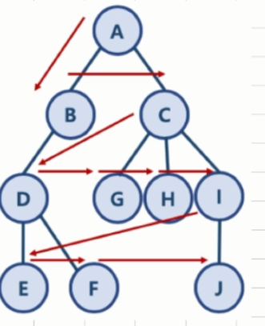

# 너비 우선 탐색


탐색에는 크게 두 가지 방법이 있다

### DFS(Depth Frist Search)

: 깊이 우선 탐색

- 왼쪽 아래를 기준으로 한쪽을 쭉 뚫고 나머지 길을 순회함.

- 가는 루트를 찾는 방법이지, 최단거리와는 거리가 멀다.

  

### BFS(Breadth Frist Search)

: 정점들과 같은 레벨에 있는 노드를 먼저 탐색하는 방식

- 한 단계씩 내려가면서, 해당 노드와 같은 레벨에 있는 노드들을 먼저 순회함.
- 높이에 맞게 왼쪽 -> 오른쪽 순서대로 찾는 방법.


​    **그래프 예시**)




인접 리스트의 형태로 각각 연결된 길을 저장한다.

```python
graph = dict()

graph['A'] = ['B', 'C']
graph['B'] = ['A', 'D']
graph['C'] = ['A', 'G', 'H', 'I']
graph['D'] = ['B', 'E', 'F']
graph['E'] = ['D']
graph['F'] = ['D']
graph['G'] = ['C']
graph['H'] = ['C']
graph['I'] = ['C', 'J']
graph['J'] = ['I']
```


### 2. BFS 알고리즘 구현

먼저 두 가지 준비물을 준비한다.

1) need_visit  queue

2) visited queue


결국 BFS에서 스택을 따라가는 것과 비슷한데,  구현하는 방식이 다르기 때문에 천천히 따라가는 것이 중요하다.


먼저 A에서 시작, FIFO를 지키면서 순회

```python
# # 1)
visited = [A]
need_visit = [B, C] ## A의 인접원소

# # 2) 
visited = [A, B] # 큐에서 순서대로 순회한다.(B)
need_visit = [C, A, D] # B의 인접 원소들이 들어옴

# # 3) 
visited = [A, B, C] # 큐에서 순서대로 순회한다.(C)
need_visit = [A, D, A, G, H, I] # C의 인접 원소들 다시 들어옴.

# # 4) 
visited = [A, B, C] # 큐에서 순서대로 순회한다.(A)
need_visit = [D, A, G, H, I] # 이미 visited에 있기 때문에 스킵.

...
```

위의 예시처럼 visited에 담겨 있으면 넘어가고, 없으면 need visit에서 추가하는 방법으로 스순회한다.

