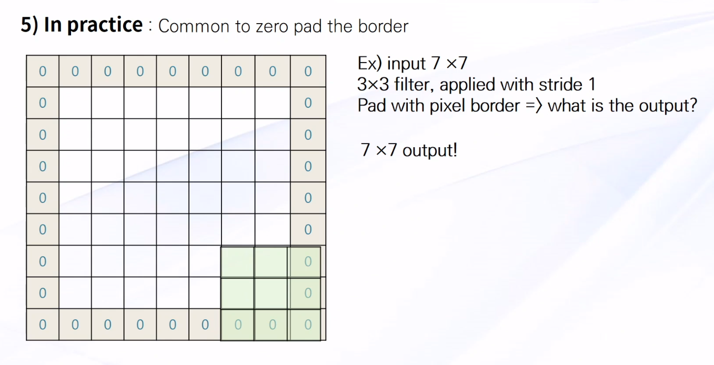

# 11. CNN 이론

## 1. CNN

### Convolution Neural Network

- CNN은 모델이 직접 이미지, 비디오, 텍스트 또는 사운드를 분류하는 딥러닝에 가장 많이 사용되는 알고리즘
- 특히 이미지에서 객체, 얼굴, 장면을 인식하기 위한 패턴 분석에 유용
- 데이터를 직접 학습하고, 패턴을 사용하여 이미지를 분류하며, 특징은 수동으로 추출할 필요가 없음
- 자율 주행 자동차, 얼굴 인식 어플리케이션과 같이 객체 인식과 컴퓨터 비전이 필요한 분야에서 CNN을 많이 사용한다.

### CNN의 구조

- Convolution layer - 이미지 줄임

- Activation layer - 활성화함수 (ex_**ReLu**)

- Pooling layer - 층이 너무 많아지는 것 방지

- Fully Connected layer - 값을 도출하기 위한 모든 노드 연결값

  

### 	1) imagination of Deep Neural Network

- 스탠포드 대학교에서 진행되는 cs231 강의를 바탕으로 진행되는 수업

  CNN의 기본적 아이디어는 고양이 실험에서 시작.

  고양이는 모든 뉴런이 동시에 작용하는 게 아닌, 순간순간의 스냅샷을 통해 기억한다.

  비어있으면 0, 진하면 1 으로 입력된 28 x 28입력형태를 1로 나열하고..

  784개의 변수들을 이용하여 0~9를 분류 가능하게끔 딥하게 진행

  

  ### 2) Start with an image(width x height x depth)

  만약 28 x 28 사이즈의 9라는 컬러숫자가 있다 => 28 x 28 * 3(rgb_layer)

  ### 3) Get one number using the filter

  ​	`Relu` 활성화함수를 통해  웨이트를 찾아가는 방법.

  ### 4) A closer look at saptial dimensions:

  - `Stride` : 연결된 값을 얼마만큼 띄어서 셀건지에 대한 설정

    - if) N by N, F by F filter => ouput size = (N-F) / stride +1
      - ex) N =7, F = 3
      - Stride 1 => (7-3) / 1 + 1 = 5
      - Stride 2 => (7-3) / 2 + 1 = 3
      - Stride 3 => (7-3) / 3 + 1 = 2.33  - 정보의 소실 문제 발생

    ouput size가 기본 이미지보다 작아지면서 발생하는 문제를 막기 위해 `Padding` 사용

  - `Padding` : 모든 변에 0만큼 채워넣는 방법. (쿠션)

  ### 5) In Practice:

  

  - Convolution Layer을 실행시켜도 같은 사이즈의 이미지가 나옴.

    - (이미지 크기를 같게 하는데 많이 사용한다.)
    - 위의 사진은 pad = 1 로 설정한 것으로
      - 1) 이미지의 형태가 급격하게 작아지는 것을 방지
      - 2) 이미지의 모서리임을 알려줌

    두 개의 역할이 가능하기 때문에 자주 사용된다.

    

    다음시간엔 LeNet-5 알고리즘을 사용한 케이스 스터디를 예시로 공부할 예정