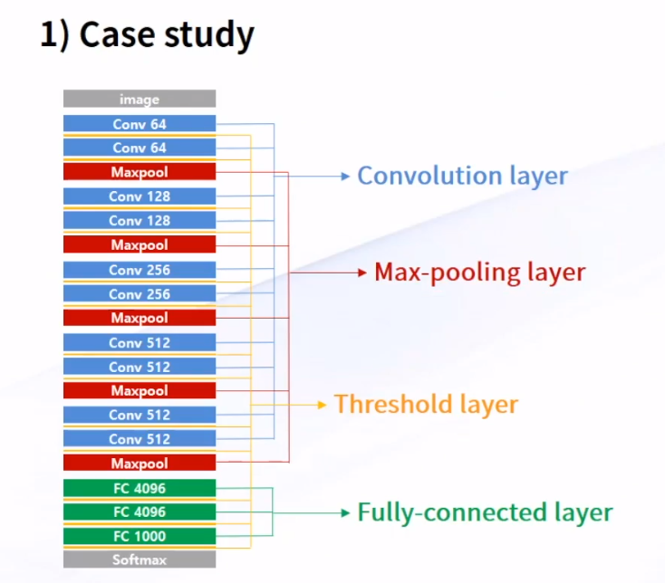
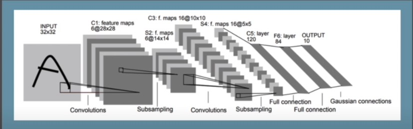

# 11. CNN 이론

## 1. CNN case study - LeNet-5

- Input image : 사진 입력
- Function - Function - Function .... 딥한 층을 이룸
- 여러 신경망들이 Fully connected된 상태로  값을 도출해낼 수 있다.

### 순서대로 따라가보자

1. 먼저 3 x 3 size의 mask를 통해 원본 이미지를 줄여나간다.

2. Maxpooling - 보통 사이즈를 줄일 때 sampling, re_sizing 이란 단어를 통해 크기를 줄이는데,

   보통 2 x 2 size를 사용하여 사이즈를 반으로 줄일 수 있게 된다.

3. 다음엔 기존 convolution layer의 두배 두께(depth 기준)의 convolution layer를 거치고 - > Maxpooling을 함.

4. 위 과정을 쭉 반복한다.

1) Maxpooling을 거칠 때마다 이미지 사이즈는 반으로줄어든다.

2) Convolution은 두 배씩 두꺼워진다. (결과적으로 x * y * z 값은 비슷하게 맞춰짐 유지)

## 2) 요약

- LeNet은 Convloution Neural Network 라는 개념을 최초로 개발한 Yann LeCun이 개발한 구조이다. LeNet은 우편번호와 수표의 필기체를 인식하기 위해 개발되었으며, LeNet-5는 1998년에 발표되었다. LeNet-5는 총 7개의 Layer로 구성되어 있으며,
- 1) 2개의 Convolution Layer,
- 2) 2개의 Sub-sampling Layer,
- 3) 2개의 Fully-Connected Layer,
- 4) 1개의 최종 출력 Layer로 이루어져 있다.

## 2. CNN - AlexNet

### (Input: 227 x 227 x 3 images)

### 1) First layer(conv-1)

LeNet-5, 32 x 32 흑백사진 => AlexNet, 컬러사진 227 x 227 x 3 사이즈로 늘어났다.

차이점 => 11 x 11 filter를 사용, depth를 96개로 과감하게늘렸다. 대신 stride를 4로 하여 빠르게 탐색.

- First layer(Conv1): 96(depth), 11 x 11 filters applied at stride 4
- Output volume **[55 x 55 x 96]**
- Parameters: (11x 11 x 3) x 96  = 35K

### 2) Second layer(Pool-1)

> After CONV1: 55 x 55 x 96

- 3 x 3 filters applied at stride 2
- Output volumn: 27 x 27 x 96
- parametes: O!