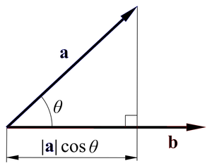
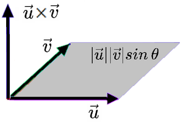

<Copy of Dacon-Deeplearning >


# 선형대수학

## 1.곱셈 연산

### 1.1. 벡터 곱셈

벡터의 곱하기는 두 가지 정의가 있다. `적` 이란 `쌓는다` 라는 뜻을 가진 한자로, 아래와 같다.

1. 하나는 dot product / inner product 라고 불리는 `내적`
2. 다른 하나는 cross product / outer product 라고 불리는 `외적`


#### 1.1.1) 내적 (inner product)

내적은 벡터를 수처럼 생각하고 곱하는 개념이다. 벡터에는 방향이 존재하므로, 두 벡터의 방향이 같다면 두 벡터의 크기를 그냥 곱하면 될 것이고, 두 벡터가 이루는 각이 90도라면, 둘이 일치하는 정도가 없기 때문에 내적의 값은 0이 될 것이다.

> 한 벡터를 다른 벡터로 정사영(projection) 시켜서 벡터를 곱한 값이다.
>
> 파이썬에서는 @ 특수문자가 (dot)이 되어 연산이 가능하다.



```python
import torch

vector1 = torch.tensor([1, 2, 3])
vector2 = torch.tensor([4, 5, 6])

dot_product = vector1@vector2
# dot_product = torch.dot(vector1, vector2) 으로 계산 가능하다.

"""
> tensor(32)
"""
```


#### 1.1.2) 외적 (outer product)

두 벡터를 구성하는 `공간` , 즉 두 벡터가 이루는 `정사각형의 넓이`이다.

> 외적의 연산 기호는 크로스(x)로, cross product라고 불리기도 하며, cartesian product라고도 한다.



```python
# matmul 함수를 통해 연산 가능하다.
matrix1 = torch.tensor([[1, 2,], [3, 4]])
matrix2 = torch.tensor([[5, 6,], [7, 8]])

mul_matrix = torch.mul(matrix1, matrix2)

"""
> print(mul_matrix)
 tensor([[19, 22],
        [43, 50]])
"""
```

- [0, 0] 인덱스 자리만 계산해보자면 다음과 같다.
  - 19 = (a_00 * b_00) + (a_01 * b_10)  = 5 + 14


#### 1.1.3) 번외. 카테시안 곱 (cartesian product)

모든 경우의수를 다 곱하는 곱으로, 만약 {1, 2, 3} {4, 5} 를 갖고 있다면, 모든 경우의수를 다 출력하는 것을 의미한다.

예시는 간단하게 들었지만, 사이즈를 보존한 형태의 곱을 말하는 것으로, SQL에서는 table join에서 유효하지 않은 조건을 적었을 때 모든 데이터에 대한 결합이 일어나며 볼 수 있다.


## 2. 행렬식 (determinant)

`determinant`는 `결정하는` 이라는 뜻을 가지고 있는 영어이다. 

무엇을 결정하느냐 하면, 행렬이 **역행렬을 가지고 있는지 없는지에 대한 여부를 결정**한다.

> 행렬식이 0이 아니면 역행렬이 존재하며, 0인 경우 존재하지 않는다.

또한, 행렬식은 행렬의 모든 이 생성하는 공간의 부피를 의미하기도 하며, 선형 변환을 통해 공간이 얼마나 확장 혹은 축소되는지를 나타내며, 그 행렬이 선형 독립적인 열 또는 행을 갖는지를 판단한다.


### 2.1. 행렬식1 - 행렬식이 0이 아닌 경우

역행렬 계산에 많이 쓰이는 ad - bc가 그 대표적인 예시.

```python
matrix_a = torch.tensor([[4, 7], [2, 6]], dtype=torch.float32)

det_a = torch.linalg.det(matrix_a)

"""
# (4 * 6) - (7 * 2) = 10

> print(det_a)
10
"""
```


### 2.2. 행렬식2 - 행렬식이 0인 경우

```python
# 3x3 행렬 정의
matrix_B = torch.tensor(
    [[1, 2, 3], 
      [4, 5, 6], 
      [7, 8, 9]], dtype=torch.float32)

# 행렬식 계산
det_B = torch.linalg.det(matrix_B)
print(f"B 행렬의 행렬식: {det_B}")
```


## 3. 역행렬 계산

` 반대의` 라는 의미의 `inverse`를 사용한다.


### 3.1. 역행렬 계산

```python
# 가역적인 2x2 행렬 정의
matrix_A = torch.tensor([[4.0, 7.0], [2.0, 6.0]])

# 역행렬 계산
matrix_inv = torch.linalg.inv(matrix_A)

print("matrix_A 행렬:\n", matrix_A)
print("matrix_A의 역행렬:\n", matrix_inv)
```

- 역행렬이 존재한다면 제대로 매트릭스를 반환하지만

- 역행렬이 존재하지 않는다면(determiant a =  0 이라면)

  LinAlgError 를 띄우며, inverse 할 수 없다는 설명을 볼 수 있다.


## 4. 트레이스 (trace)

트레이스는 선형대수학에서 사용되는 용어로, 정사각행려에 대해 정의된다.

행렬의 대각선상에 위치하는 모든 원소의 합으로, 다음과 같이 사용 가능하다.

```python
tensor = torch.arange(1, 10).reshape(3, 3) # 1~9 까지의 3x3 matrix

trace_A = torch.trace(tensor)
"""
> 1 + 5 + 9
15
"""
```


## 5. 고유값과 고유벡터 (eigenvalues & eigenvectors)

고유값(Eigenvalue)는 0벡터가 아닌 고유벡터  v에 대해, 

(A * v) = (lambda * v) 를 만족시키는 스칼라 람다값에 해당된다.


고유값과 고유벡터는 보통 차원 축소와 특성 추출 (특히 주성분 분석, PCA)에서 데이터 차원의 복잡성을 줄이고, 불필요한 노이즈를 제거하는 데에 유용하게 쓰인다.

```python
import torch

# 행렬 A 정의
A = torch.tensor([[4.0, 1.0], [2.0, 3.0]])

# 고유값과 고유벡터 계산
eigenvalues, eigenvectors = torch.linalg.eig(A)

print("행렬 A의 고유값:")
print(eigenvalues)
print("행렬 A의 고유벡터:")
print(eigenvectors)
```


## 6. 특이값 분해 (SVD, singular vector decomposition)

**SVD**는 선형대수에서 매우 중요한 기법 중 하나로, 임의의 크기의 행렬을 특정한 구조로 분해하는 방법이다. 고유값 분해처럼 행렬을 대각화하는 방법이지만, 정방행렬이든 아니든 m x n 행렬에 대해 적용 가능하기 때문에 굉장히 유용하다.


A라는 행렬을 U, S, Vt 라는 세 가지로 요소로 분해할 수 있는데, 각각의 의미하는 건 아래와 같다.

- A: m x n 사이즈의 원본 행렬
- U: m x m 사이즈의 직교 행렬이며, A의 왼쪽 특이벡터를 열벡터로 가져간다. (left singular vector)
- S: m x n 크기의 대각행렬로, 대각선 상의 원소는 특이값이며 일반적으로 내림차순 정렬한다.
- Vt: n x n 크기의 직교 행렬의 전치행렬로, A의 오른쪽 특이벡터를 열벡터로 가져간다. (right singular vector)

> 어려운 개념이다...
>
> 참고 링크로 공부하자. 
>
> [SVD 참고링크](https://bkshin.tistory.com/entry/%EB%A8%B8%EC%8B%A0%EB%9F%AC%EB%8B%9D-20-%ED%8A%B9%EC%9D%B4%EA%B0%92-%EB%B6%84%ED%95%B4Singular-Value-Decomposition)

