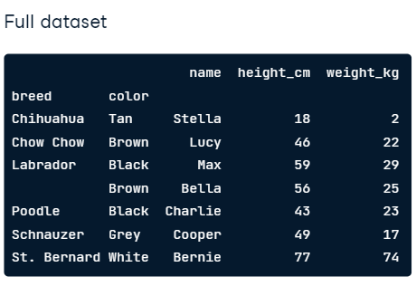

# 1. Data Manipulation with pandas


##  1) Introducing DataFrames

"표 형식 데이터" 라고 불리는 가장 일반적인 형식의 직사각형 데이터를 사용한다.


### 1. 데이터 확인을 위한 기본 문법

```python
import pandas as pd

# 데이터 불러오기
dogs = pd.read_csv("dataset/dogs.csv")

# 상위/하위 5개 출력
dogs.head()
dogs.tail()

# 기본 정보 확인 - info, describe, shape
dogs.info()
dogs.describe()
dogs.shape # <-- method가 아니라 attribute이다.

# columns, index, values
dogs.values # <-- 2차원 Numpy 배열의 데이터 값을 포함하여 제공
dogs.columns # <-- 열 이름 // Index(['name', 'phone_num'], dtype='object')
dogs.index # <-- 행 번호, 행 이름 // RangeIndex(start=0, stop=7, step=1)
```


### 2. Sorting and subsetting

데이터 정렬과 서브셋


#### Sorting

```python
# column을 기준으로 하는 정렬
dogs.sort_values('weight_kg', ascending=False) # 오름차순 정렬 해제
dogs.sort_values(['weight_kg', 'height_cm']) # 여러 변수 기준 정렬

# 각각에 대해서 오름차순 내림차순 적용도 가능하다.
dogs.sort_values(['weight_kg', 'height_cm'], ascending=[True, False])
```


#### Subsetting

```python
# 단일 컬럼
dogs["name"]
dogs.name # <-- 단, 컬럼 이름에 공백이 없어야 함.

## 다중 컬럼
# 방법1
dogs[["breed", 'height_cm']]
# 방법2
cols_to_subset = ["breed", 'height_cm']
dogs[cols_to_subset]

## 필터링 논리 조건 만들기
dogs["height_cm"] > 50
dogs[dogs["height_cm"] > 50]
dogs[dogs["breed"] == "Labrador"]
dogs[dogs["date_of_birth"] < "2015-01-01"]

# 여러 조건을 다중으로 걸기
is_lab = dogs["breed"] == "Labrador"
is_brown = dogs["color"] == "Brown"
dogs[is_lab & is_brown] ## and, or 연산자 등을 사용할 수 있다.

# isin() 을 사용한 필터링
is_black_or_brown = dogs["color"].isin(["Black", "Brown"])
dogs[is_black_or_brown]
```


## 2. Aggregating DataFrames

### 1. Summary statistics

```python
dogs["height_cm"].mean()
```

이 외에도 여러 가지 통계적인 함수가 있다.

- `.median()`
- `.mode()`
- `.min()` , `max()`
- `.var()`, `.std()`
- `.sum()`

#### 여러 가지 누적함수를 적용하는 .agg() method

```python
# 30번째 백분위수를 계산하는 quantile 함수 작성
def pct30(column):
    return column.quantile(0.3)

# 함수를 적용하기 w/ agg function
dogs["Weight_kg"].agg(pct30)

# 여러 가지 변수에 통계적 함수 적용하기
dogsp[["weight_kg", "height_cm"]].agg(pct30)


# 백분위수 40번째를 계산하는 새로운 pct40 함수 생성
def pct40(column):
    return column.quantiel(0.4)

# 30번째, 40번째 백분위수를 함께 구해보자
dogs["weight_kg"].agg([pct30, pct40])
```


#### Cumulative sum (누적합)

```python
dogs["weight_kg"].cumsum()
```

- `.cumsum()` : 누적 합
- `.cummin()`  : 누적 최솟값
- `.cumman()`  : 누적 최댓값
- `.cumprod()`  : 누적 곱


#### Counting

> 갯수 세기에서 중요한 문제는 Avoiding double counting(중복 제거)
>
> 즉, dropping duplicate 문제라고도 볼 수 있다.

1) Dropping duplicate names

   ```python
   # subset으로 찾고자 하는 부분집합 인수를 취해준다.
   vet_visits.drop_duplicates(subset="name") 
   
   # 근데, 종이 다른데 이름만 같은 경우, 위와 같이 처리해버리면 하나가 사라지게 된다.
   # 만약 여러 열에 대한 중복 삭제를 기반으로 하려면 다음과 같이 전달할 수 있다.
   unique_dogs = vet_visits.drop_dulicates(subset=["name", "breed"])
   # 이렇게 함으로써, 이름이 같은 강아지도 종이 다르면 다르게 인식할 수 있게 된다.
   ```

2) Easy as 1,2,3

   ```python
   # unique dogs 카운팅
   unique_dogs["breed"].value_counts()
   # 물론 ascending의 기본 인자는 False이다.
   unique_dogs["breed"].value_counts(sort=True, ascending=False) 
   
   # 얼마나 비율을 차지하는지 확인하기
   # 아래 두 줄 모두 같은 결과를 가져오지만, value_counts를 사용하면 훨씬 쉽게 할 수 있다.
   unique_dogs["breed"].value_counts(normalize=True)
   unique_dogs["breed"].apply(lambda x: x/len(unique_dogs))
   
   ```


### 2. Grouped summary statistics

소챕터 1에서는 행에 대한 요약통계에 대해 정리했다면, 이번엔 요약 통계를 사용한 다른 그룹간의 비교에 대해 정리해보도록 하자.


#### Summaries by group

```python
# 지금까지 배운 것들을 활용하여, 강아지 색에 따른 요약 통계를 볼 수 있다.
dogs[dogs["color"] == "Black"]["weight_kg"].mean()
dogs[dogs["color"] == "Brown"]["weight_kg"].mean()
dogs[dogs["color"] == "White"]["weight_kg"].mean()
dogs[dogs["color"] == "Gray"]["weight_kg"].mean()
dogs[dogs["color"] == "Tan"]["weight_kg"].mean()
```

>  근데 같은 줄을 다섯 번이나 반복하는데, 불편하지 않을 수가 없다.

#### Grouped summaries

```python
# 색상 변수로 그룹화하고, 'weight_kg' column을 선택한 후 평균을 취할 수 있다.
# 위의 코드가 단 한 줄의 코드로 변경되어 쓰여진 것!
dogs.groupby("color")["weight_kg"].mean()
```

#### Multiple grouped summaries

```python
# 요약통계에서 봤던 agg(누적함수)를 groupby함수에도 똑같이 적용할 수 있다.
dogs.groupby("color")["weight_kg"].agg([min, max, sum])

# 여러 열로 그룹화하고 요약통계를 진행할 수도 있다.
# ex) Black Poodle / Black Labrador / Black Chow Chow 
dogs.groupby(["color", "breed"])["weight_kg"].mean()

# 마찬가지로 여러 개의 항목에 적용할 수도 있고.
dogs.groupby(["color", "breed"])[["weight_kg", "height_cm"]].mean()
```


### 3. Pivot tables

피벗 테이블은 그룹화된 요약 통계를 계산하는 또 다른 방법. (더 시각적이고 직관적인 스프레드시트)

#### Group by to pivot table

```python
# 그룹바이를 사용했을 때
dogs.groupby("color")["weight_kg"].mean()

# pivot table을 사용했을 때 유사한 결과를 받는다.
dogs.pivot_table(values="weight_kg",
                index"color")
# index ==> groupby와 유사, 그룹화하려는 열.
# values ==> 선택할 컬럼의 값
# 기본적으로 pivot_table은 각 그룹의 평균값을 취한다.

import numpy as np
dogs.pivot_table(values="weight_kg",
                 index="color",
                 aggfunc=np.median) # 중앙값으로 구할 수도 있음.

# Multiple statistics 
# groupby와 동일하게, 여러 개의 변수에 대해 피벗테이블을 한번에 적용할 수 있다.
dogs.pivot_table(values="weight_kg",
                index="color",
                aggfunc=[np.mean, np.median])
```


#### Pivot on two variables

```python
# 평범한 다변수 그룹바이
dogs.groupby(["color", "breed"])["weight_kg"].mean()

# 피벗테이블 버전 ~ 그룹바이와 다르게 n x m 직사각 행렬로 나오며 NaN값이 존재한다.
dogs.pivot_table(values="weight_kg",
                 index="color",
                 columns="breed", 
                 aggfunc=np.mean)

# NaN을 처리하는 매개변수 fill_value
dogs.pivot_table(values="weight_kg",
                 index="color",
                 columns="breed",
                 fill_value=0, # 모든 NaN 을 0으로 채움
                 aggfunc=np.mean)

# 0으로 채워진 누락값을 제외한 모든 값의 평균 margins
dogs.pivot_table(values="weight_kg",
                 index="color",
                 columns="breed",
                 fill_value=0,
                 margins=True,
                 aggfunc=np.mean)
```


### 4. Explicit indexes (인덱스 명시)

#### Setting a column as the index

```python
# 이름을 인덱스로 정해버리기! 인덱스 값은 왼쪽 정렬로 이루어진다.
dogs_ind = dogs.set_index("name")
print(dogs_ind)
```

#### Removing an index

```python
# 위에서 수행한 작업을 취소하고, 인덱스를 재설정할 수 있다.
dogs_ind.reset_index()

# Dropping an index
# reset_index에는 인덱스를 삭제할 수 있는 drop 인수가 있다.
dogs_ind.reset_index(drop=True) # name 인덱스를 삭제해버리는 것.
```

이게 왜 중요하냐? 왜 인덱스에 신경을 써야 하냐?

> 집합을 위한 코드를 더 깨끗하게 만들기 때문에.


#### Indexes make subsetting simpler

```python
# name이 Bella, Stella 인 두 친구들을 인덱스로 잡고 집합화 할 수 있다.
dogs[dogs["name"].isin(["Bella", "Stella"])]

# Simpler way
dogs_ind.loc[["Bella", "Stella"]]
```

인덱스 값은 고유하지 않아도 된다.

```python
dogs_ind2 = dogs.set_index("breed") 
# 하위 집합 생성하면, 모든 labrador의 데이터가 반환
dogs_ind2.loc["Labrador"]
```


#### Multi-level indexes a.k.a hierarchical indexes

```python
# 계층형 인덱스
# groupby(["breed", "color"]) 와 유사하다.
dogs_ind3 = dogs.set_index(["breed", "color"])

# Subset the outer level with a list
dogs_ind3.loc[["Labrador", "Chihuahua"]]
# Subset inner levels with a list of utples
dogs_ind3.loc[[("Labrador", "Brown"), ("Chihuahua", "Tan")]]
```


#### Sorting by index values

```python
# index별로 정렬이 가능하다. // 기본적으로 모두 외부에서 내부로 오름차순이다.
dogs_ind3.sort_index()

# Controlling sort_index
dogs_ind3.sort_index(level=["color", "breed"], ascending=[True, False])
```

​	

#### Index를 사용하는 데 있어서 두 가지 문제점이 있을 수 있다.

하위 집합 코드를 단순화하지만 몇 가지 단점이 있는데.

1. 인덱스 값은 단순히 데이터이다. 데이터를 여러 형태로 저장하면 생각하기가 더 어려워진다.
2. 인덱스 값은 자체 열을 갖지 않기 때문에, DataFrame처럼 저장되는 `tidy form`을 위배한다.
3. 인덱스 작업을 위한 구문은 열 작업을 위한 구문과 달라, 문법을 위한 별도의 공부가 필요하다.

이러한 이유로, **인덱스를 사용하지 않기로 했다면 그것 또한 좋은 결정**이다.

**(다만, 다른 사람의 코드를 읽어야 하는 경우에는 어떻게 작동하는지 아는 것이 매우 중요하다.)**


### 5. Slicing and subsetting with .loc and .iloc

슬라이싱을 통해 연속된 요소를 선택할 수 있다.

```python
breeds = ["Labrador", "Poodle",
         "Chow Chow", "Schnauzer",
         "Labrador", "Chihuahua",
         "St. Bernard"]

breeds[2:5] # ["Chow Chow", "Schnauzer", "Labrador"]
```

하지만 조금 더 잘 사용하기 위해선 먼저 정렬을 해주는 게 좋다.

#### Sort the index before you slice

```python
dogs_srt = dogs.set_index(["breed", "color"]).sort_index()
# Slicing the outer index level

# final value "Poodle" isincluded
dogs_srt.loc["Chow Chow":"Poodle"]
```

리스트의 슬라이싱과 두 가지 차이점이 있다.

1. 행 번호를 지정하는 대신 인덱스 값을 지정
2. 최종 값이 포함되어 있음


근데, 내부 인덱스 수준에서는 동일하게 또 적용되진 않는다.

#### Slicing the inner index levels badly

```python
# 이렇게 해도 아무런 값이 출력되지 않는다.
dogs_srt.loc["Tan":"Grey"]
```



이를 제대로 출력하기 위해선 inner level로 제대로 접근해야 한다.

#### Slicing the inner index levels correctly

```python
dogs_srt.loc[("Labrador", "Brown"), ("Schnauzer", "Grey")]
```

물론, DataFrame은 2차원 개체이므로 열을 슬라이스 할 수도 있다.

```python
# Slicing columns
dogs_srt.loc[:, "name":"height_cm"]

# Slice twice (행과 열을 동시에 슬라이스)
dogs_srt.loc[("Labrador", "Brown"):("Schnauzer", "Grey"),
            "name":"height_cm"]
'''
첫 : (Labrador~Schnauzer) 는 인덱스에 대한 슬라이싱을,
두번째 : (name~height) 는 컬럼에 대한 슬라이싱을 진행한다.
'''
```


#### **슬라이싱의 중요한 사용 방법 중 하나는, 데이터프레임을 날짜 범위별로 하위 집합으로 만드는 것!**

> 날짜가 문자열로 전달되는 것 잊지말자. 중요하다!!!

```python
# Dog days
dogs = dogs.set_index("date_of_birth").sort_index()

# get dogs with date_of_brith between 2014-08-25 and 2016-09-16
dogs.loc["2014-08-25":"2016-09-16"] # 날짜는 문자열로 전달됨.

# 유용한 기능은, 그냥 부분적인 날짜로도 슬라이싱이 가능하다는 것.
dogs.loc["2014":"2016"]
```


리스트의 슬라이싱과 유사하게, 열번호 혹은 행 번호로도 슬라이싱을 할 수 있다.

#### Subsetting by row/column number

```python
dogs.iloc[2:5, 1:4]
```

다만,  loc사용과 달리 최종 값이 슬라이스에 포함되지 않는다.


### 6. Working with pivot tables

```python
# Pivoting the dog pack
dogs_height_by_breed_vs_color = dog_pack.pivot_table(
	"height_cm", index="breed", columns="color")

# .loc slicing is a power combo
dogs_height_by_breed_vs_color.loc["Chow Chow":"Poodle"]

# The axis argument
dogs_height_by_breed_vs_color.mean(axis="index") # default
dogs_height_by_breed_vs_color.mean(axis="columns")

'''
	기본값은 "인덱스"이며, "행 전체의 통계 계산"을 의미함.
'''
```

 

```python
# numpy.datetime[ns] type에서 year만 걸러내기
# temperatures 라는 DataFrame이 있을 때,

# get ["year", "month", "day"] from datetime[ns]
# 이렇게 뽑아낸 각각의 연월일 dtype은 int64
temperatures["date"].dt.year() 
temperatures["date"].dt.month()
temperatures["date"].dt.day()

# 그럼 애초에 year을 int로 바꿔주면 어떨까? > astype(int)로 변환하기.
# 뭔가 방법이 있을 것 같은데, 잘 안된다. ㅠㅠ

```


### 7. Visualizing your data

#### Histograms

```python
import matplotlib.pyplot as plt

dog_pack["height_cm"].hist() # histogram 생성
plt.show()					 # 시각화 show

# 막대의 수를 조정할 수 있다...?
dog_pack["height_cm"].hist(bins=20)
plt.show()
dog_pack["height_cm"].hist(bins=5
plt.show()
```


#### Bar plots

```python
avg_weight_by_bread =dog_pack.groupby("breed")["weight_kg"].mean()
print(avg_weight_by_breed)

avg_weight_by_breed.plot(kind="bar")
plt.show()

# bar plot으로 title설정
avg_weight_by_breed.plot(kind="bar", title="Mean Weight by Dog Breed")
plt.show()
```


####  Line plots

```python
sully.head()
sullpy.plot(x="date",
            y="weight_kg",
            kind="line")
plt.show()
```


#### Rotating axis labels

```python
# 라벨을 45도 회전시켜주면 더 깔끔하게 표현할 수 있다.
sully.plot(x="date", y="weight_kg", kind="line", rot=45)
plt.show()
```


#### Scatter plots

```python
dog_pack.plot(x="height_cm", y="weight_kg", kind="scatter")
plt.show()
```


#### Transparency (반투명)

```python
# alpha : 불투명도
dog_pack[dog_pack["sex"]=="F"]["height_cm"].hist(alpha=0.7)
dog_pack[dog_pack["sex"]=="M"]["height_cm"].hist(alpha=0.7)
plt.legned(["F", "M"]) # 범주에 이름 붙이기
plt.show()
```


### 8. Missing values

모든 데이터가 완벽하지 않을 수 있다. 데이터가 누락 된 경우, NaN (Not a Number) 으로 표현되며 아래와 같이 누락 여부를 체크하면서 시작하는것이 좋다.


#### Detecting missing values

```python
dogs.isna() # 모든 컬럼에 대해 빈 값이 있는지 True/False로 표시
dogs.isna().any() # 해당 열에 누락된 값이 있는지만 확인
```

#### Counting missing values

```python
dogs.isna().sum()
```

#### Plotting missing values

```python
import matplotlib.pyplot as plt
dogs.isna().sum().plot(kind="bar")
plt.show()
```


이런 식으로, 누락된 값들을 알아냈다면 무엇을 할 수 있을까?

#### 1) Removing missing values

```python
dogs.dropna()
```

가장 편한 방법이지만, 누락된 값이 많은 경우 적용할 수 없다.


#### 2) Replacing missing values

```python
dogs.fillna(0)
```

누락된 값을 모두 0으로 채워버리는 방법. 물론 다른 방법들도 많다.


### More to learn

- Joining Data with Pandas
- Streamlined Data Ingestion with Pandas
