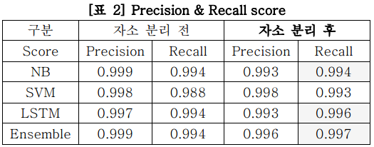

# 머신러닝을 이용한 불법 의약품 판매 게시글 탐지


### 프로젝트 개요 및 진행 배경

- 전문 의약품을 온라인에서 매매하는 것은 법적으로 금지되어 있지만, 온라인에서 사고파는 게시글을 쉽게 찾아볼 수 있다. 이러한 거래를 막기 위해 여러 시도를 하고 있지만, 일일이 확인하기란 시간이 많이 소요되는 일이며, 비효율적이다.

​	이러한 게시글을 더 빠르고 정확하게 판별하여 불법 거래를 막기 위해 프로젝트를 진행하였다.

<br>

### 데이터 설명

- 사용된 데이터는 트위터 고급검색이 가능한 웹 크롤링 패키지인 twitterscrapper를 이용해 수집하였다.

- 수집된 데이터는`총 106,448 건의 게시글`이며, 4명이서 직접 라벨링 한 결과 

  102,670건의 불법 판매글 /  3,778개의 일반 게시글로 나뉘어졌다.

  - 따라서 데이터 불균형의 문제를 해결하기 위해 해당 클래서의 일부만 사용하는 Random Undersampling 기법을 사용하였다. (불법 판매글 약 5,000개만 사용)

<br>

### 기여한 부분

- 라벨링은 4명의 팀원이 모두 나눠 약 25,000~27,000건 수작업 분류했으며,
- 전처리 부분과 모델링 중 Naive bayes 부분을 맡아 진행하였다.


<br>


## 1. 파일 불러오기 및 아이디어 제시

<h6> (실제 데이터 예시) </h6>

- Label 0: 불법 판매 게시글

- Label 1: 일반 게시글

#### 원본파일.head() => (label / text)

```markdown
(Label)  					(Text)
1.0  사람들이 잘 모르는데 진짜 유명해졌으면 하는 일본 편의점 음식 #일본 #미니스톱 #...      
2.0  [#아이스의오락시간] #아이스 의 오락시간 \n과연 누가 아이스의 유연성 왕일지 얼...      
3.0  오. 오랫만에 #아이스 #돌체라떼 음 맛있겠다 (@ Starbucks in 부산광역...      
4.0  [맛집탐험대] 나를 놀라게한 커피 "TERAROSA" \n\n#TERAROSA #테...      
5.0  #로렉스 #아이스# 다이아#고씨쥬얼리#명품시계#금#화이트#골드#화이트골드 https...      
```

불법 게시글의 특징은 **`고의로 사용된 특수문자, 자음 모음이 분리된 오탈자가 많다`** 라는 점으로,

이를 위한 아이디어로,

##### `한글만 남긴 뒤 자소 분리 후 판별` 하는 방법을 사용 하고자 하였다.


## 2. 전처리

###  	2.1) 띄어쓰기 기준 word 구분

먼저 띄어쓰기를 구분자로 하여, word별로 나누어주었다.

```=python
def split_all_sentence(text_data): # type(text_data) => DataFrame
    result = []
    count = 0
    for text in list(text_data):
        temp = text.split(sep=" ")
        result.append(temp)
    return result
```

<h6> 결과값 예시</h6>

> ```markdown
> # print(split_all_sentence(data["Text"][:2]))
> 
> 
> [
> 	['사람들이', '잘', '모르는데', '진짜', '유명해졌으면', '하는', '일본', '편의점', '음식', '#일본', '#미니스톱', '#아이스', '#果実いちご氷', '세상사람들', '이것', '좀', '먹어보세요ㅠ유유ㅠㅠㅠ', '위에는', '달달한', '바닐라', '아이스고', '밑에는', '얼린', '딸기에', '연유가', '뿌려져', '있어요pic.twitter.com/KOERcUnoPR'],
>     
> 	['[#아이스의오락시간]', '#아이스', '의', '오락시간', '\n과연', '누가', '아이스의', '유연성', '왕일지', '얼른보러가요오\n\n링크\nhttps://youtu.be/CIrDBMGpi88\xa0']
> 	
> ]
> ```


### 	2.2) URL 제거

이미지나 영상을 첨부한 게시글에서 글자만 남기기 위해 URL을 제거해줬다.

```python
#data에 있는 text 데이터에 대해 url 전부 제거
def remove_url(text_data):
    result = []
    for line in text_data: 
        new_line = []
        for text in line: # 단어별로 나눠진 텍스트들이 http, pic을 담고있다면 문장에서 제외
            if ("http" not in text) and ("pic" not in text):
                new_line.append(text) 
        result.append(new_line)
    return result
```

- <h6> 결과값 예시</h6>

> ```markdown
> # 	a = remove_url(split_all_sentence(data["Text"]))
>   	print (a)
> [['사람들이', '잘', '모르는데', '진짜', '유명해졌으면', '하는', '일본', '편의점', '음식', '#일본', '#미니스톱', '#아이스', '#果実いちご氷', '세상사람들', '이것', '좀', '먹어보세요ㅠ유유ㅠㅠㅠ', '위에는', '달달한', '바닐라', '아이스고', '밑에는', '얼린', '딸기에', '연유가', '뿌려져'], ['[#아이스의오락시간]', '#아이스', '의', '오락시간', '\n과연', '누가', '아이스의', '유연성', '왕일지']
> ```


### 2.3) 특수문자 및 숫자 제거

```python
#특수문자를 모두 제거하는 함수
def change(otl):
    result = []
    for line in otl:
        result_text = ""
        for word in line:
            if word.isalpha() : # 단어에 특문이 포함되지 않은 경우
                result_text += word
            else:
                for t in word: # 단어에 특문, 숫자가 포함된 경우 문자별로 파악
                    if t.isalpha():
                        result_text += t
                    else:
                        result_text += " " # 사라질 문자는 'space' 로 대체
            result_text += " "
        result.append(result_text)
```

- <h6> 결과값 예시</h6>

> ```markdown
> # 	print(change([['#얼음활용법\n#얼음', '#아이스\n#생활꿀팁\n#경기도경제과학진흥원', '#GBSA\n\n집에', '보관해둔', '얼음을', '생활', '곳곳에서', '알뜰하게', '활용하는', '방법을']]))
> 
> [' 얼음활용법  얼음  아이스  생활꿀팁  경기도경제과학진흥원  GBSA  집에 보관해둔 얼음을 생활 곳곳에서 알뜰하게 활용하는 방법을 ']
> ```


-  띄어쓰기가 2칸 이상이면 한칸으로 조정

```python
def trim_spacing_word(changed_text):
    new_text = []
    for line in changed_text: # 한 줄씩 읽기.
        tmp = []
        for word in line.split(): # split(delimeter = whitespace) > default
            if word != " ":
                tmp.append(word)
        new_text.append(" ".join(tmp))
    print(new_text)
```

- <h6> 결과값 예시</h6>

> ```python
> # test = [' 얼음활용법  얼음  아이스  생활꿀팁  경기도경제과학진흥원  GBSA  집에 보관해둔 얼음을 생활 곳곳에서 알뜰하게 활용하는 방법을 ']
> 
> trim_spacing_word(test) 
> '''
> > ['얼음활용법 얼음 아이스 생활꿀팁 경기도경제과학진흥원 GBSA 집에 보관해둔 얼음을 생활 곳곳에서 알뜰하게 활용하는 방법을']
> '''
> ```


### 2.4) 형태소 분석(MeCab)

- 한글 형태소 분석으로, 우리는 특정 형태소만 가져오기로 하였다.
  - 명사, 고유명사, 동사, 형용사, 어근, `알 수 없음`


```python
#길이가 10 이상인 경우, 형태소 분석기로 나눠주는 함수
import MeCab

# custom_list = ["NNP","NNG","VV","VA","XR", "UNKNOWN"]
def ko_tag(text, custom_list =  ["NNP","NNG","VV","VA","XR", "UNKNOWN"]):
    tagger = MeCab.Tagger()
    real = tagger.parse(text)
    separate_text = real.split()
    real_text = separate_text[:-1] # split된 마지막 요소엔 EOS 가 들어가서 잘라줘야함
    words = []
    types = []

    
    for i in range(len(real_text)):
        if i%2 == 0 :
            words.append(real_text[i])
        else:
            #istype = real_text[i].split(sep = ",")[0]
            types.append(real_text[i].split(sep = ",")[0])
            #if istype in custom_list :
                #types.append(real_text[i].split(sep = ",")[0])
    ans = list(zip(words,types))
    return ans
```

- <h6> 결과값 예시</h6>

> ```python
> # test = [' 얼음활용법  얼음  아이스  생활꿀팁  경기도경제과학진흥원  GBSA  집에 보관해둔 얼음을 생활 곳곳에서 알뜰하게 활용하는 방법을 ']
> 
> print(ko_tag(test))
> 
> '''
> > ['얼음', '활용', '법', '얼음', '아이스', '생활', '꿀', '팁', ',경기도', '경제', '과학진흥원', '집', '보관', '얼음', '생활', '알뜰하','활용', '방법']
> '''
> ```


###  2.5) 자모 분리 & 한글만 보기(hgtk)

- hgtk 는 한글 자모 분리/조합을 위한 툴킷으로, 깃허브에 올라와 있는 것을 사용하였다.

(사용 예시)

```python
## 각 음절에 맞게 자소를 꼴뚜기로 분리해준다.
import hgtk

a = hgtk.text.decompose("아이스")

print(a)
>> ㅇㅏᴥㅇㅣᴥㅅㅡᴥ 

print(a.replace("ᴥ",""))
>> ㅇㅏㅇㅣㅅㅡ
```

---

```python
## 함수로 나타냈을 때
import hgtk

def decompose_text(text_list):
    new_list = []
    for text in text_list:
        decomposed = hgtk.text.decompose(text)
        new_list.append(decomposed.replace("ᴥ",""))
    return new_list

## 영어, 한자, 일본어 등 제거
def remove_alpha(text_list):
    new_list = []
    alpha = "abcdefghijklmnopqrstuvwxyz"
    for text in text_list:
        one = ""
        for m in text.lower():
            if m not in alpha :
                one += m
        new_list.append(one)
    return new_list
```

- <h6> 결과값 예시</h6>

> ```python
> # 	test = ['사람들이 모르는게 good']
> 
> after_decompose = decompose_text(test)
> after_remove = remove_alpha(after_decompose)	# 자소분리
> print (after_remove)						   	# 영어제거
> 
> """ 
> <result>
> ['ㅅㅏㄹㅏㅁㄷㅡㄹㅇㅣ ㅁㅗㄹㅡㄴㅡㄴㄱㅔ']
> """
> ```


## 3. 모델링

텍스트 스팸 필터링에서 가장 많이 쓰이는 모델인 Naive bayes, 그리고 분류 성능이 그보다 더 뛰어나다고 알려진 SVM, 그리고 딥러닝 모델인 LSTM을 사용하였다.


### 3.1) 머신러닝 모델


#### 3.1.1) TF-IDF

고전적인 자연어 처리 기법으로, 카운트 기반의 문서 단어 행렬을 만들어주는 기법을 사용하였다.

NLP는 대부분 고차원으로 나오기 때문에 최대 10만개의 단어만 사용하기로 하였고, 훈련셋과 학습셋 비율은 8:2로 구분하였다.

```python
# raw데이터를 훈련-테스트 데이터로 나눈후 , fitting해서 리턴
def data_transformer(data):
    Train_X, Test_X, Train_Y, Test_Y = train_test_split(data['Text'],data['Label'],test_size=0.2, random_state = 1)
    
    Tfidf_vect = TfidfVectorizer(max_features = 100000)
    Tfidf_vect.fit(Train_X[:].values.astype('U'))

    Train_X_Tfidf = Tfidf_vect.transform(Train_X[:].values.astype('U'))
    Test_X_Tfidf = Tfidf_vect.transform(Test_X[:].values.astype('U'))

    Tfidf_vect = TfidfVectorizer(max_features = 100000)
    Tfidf_vect.fit(Train_X[:].values.astype('U'))

    Train_X_Tfidf = Tfidf_vect.transform(Train_X[:].values.astype('U'))
    Test_X_Tfidf = Tfidf_vect.transform(Test_X[:].values.astype('U'))
    
    return Train_X_Tfidf, Test_X_Tfidf, Train_Y, Test_Y
```


#### 3.1.2) Naive bayes

싸이킷 런 모듈에 있는 나이브 베이즈를 사용하였다.

```python
def learning_MNB(Train_X,Train_Y):
    Naive = naive_bayes.MultinomialNB()
    Naive.fit(Train_X,Train_Y)
    return Naive

def predict_MNB(model,Test_X):
    predictions_NB = model.predict(Test_X)
    return predictions_NB
```

+ 그리고 추가로 SVM, LSTM을 사용하였다.


### 3.2) 앙상블 방법

앙상블(Ensemble)은 단일 모델이 아닌, 여러 개의 모델을 이용하여 함께 예측을 하는 방법이다. 

앙상블 기법은 Voting, Bagging, Boosting, Stacking이 있는데, 그 중에서 우리는 Hard Voting을 사용하였다. (각 모델에게 투표권을 한 장씩 주는 방법.)


## 4. 실험 결과

성능 지표로 **재현율(Recall - 실제 정답 중에 모델이 정답이라고 판별한 것의 비율)을 사용**하였다.

`Recall`을 사용한 이유는, 무고한 사람들을 최대한 피해가는 것이 중요하다고 생각했기 때문이다.


</img>


자소분리를 하기 전보다, 자소분리를 함으로써 Recall Score가 모두 올라갔음을 알 수 있었다.
