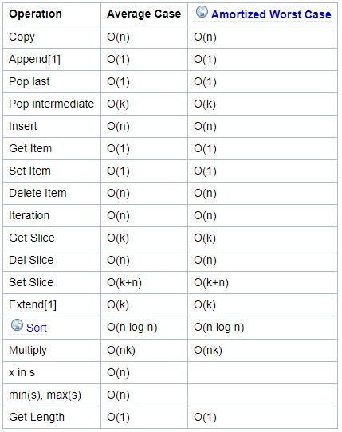
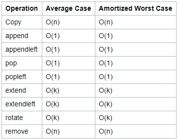

# OOP(Object Oriented Programming)

## 1. 프로그램  
==> 자료구조 + 알고리즘  

## 2. 앞으로 할 것  
### 패러다임(-접근 방법)에 대해 배움.  

> 1. 구현 / 완전탐색 (Brute force)  
> 2. 동적 프로그래밍 (Dynamic Programming - DP)  
> 3. 탐욕 알고리즘   (Greedy Algorithm)  

만약 우리에게 무한한 자원(컴퓨터, 시간)이 있다면  
완전탐색으로 대부분의 문제를 할 수 있겠지만,  
현실에는 그러한 환경이 자주 주어지지 않는다.

즉 자원을 효율적으로 사용하기 위해 스택, 큐, 그래프 등의 자료구조를 사용하게 된다.  
<br>  
<br>

~~ 시간 비교 ~~
#### - 리스트 시간복잡도.


#### - 큐 시간복잡도

~ append와 pop모두 O(1)로 굉장히 효율적이다.
<br>
<br>

## 3. 자료 구조
### 1) 선형 자료 구조
대부분 안에 들어오는 데이터들끼리 연계관계가 없거나 사이의 관계를 만들어내기 힘들다.  
`ex) Array(list), Stack, Queue`
 >추가하자면, Linked-list 를 먼저 배우는 경우가 많다. 사실상 사용하지 않는 큐, 스택으로 구현되기 때문에 사용되지 않는다.


 1) **Stack**  
    - `LIFO`(Last-In, First-Out)  
        - 원형 통, 바닥부터 쌓는 책이라고 보기면 좋다.  
        - 프로그램 프로세스 처리 시 사용된다.

    - push(), pop() 두 가지를 사용한다.
        - 파이썬에서는 리스트의 pop이 있어 스택처럼 사용 가능!
        - 만약 중간값을 찾는 문제라면 스택은 사용하지 않는다. (사용이 제한적)
        
    - 알고리즘에서의 활용
        - 문자열 뒤집기
        - 괄호, 후위표기법 매칭
        - 순서를 뒤집는 경우
        - 상승 -> 하강 패턴의 문제
        - DFS(Depth-First Search)
        - SWEA 농작물 수확 문제 등등

    - DFS & SW에서 활용의 예시.
        - 함수 호출 ex.Recursive
        - 실행 취소
        - 브라우저 히스토리
 2) **Queue**  
    - `FIFO`(First-In, First-Out)
    - 앞이 열린 원통. 

### 2) 비선형 자료 구조
데이터들끼리는 관계를 맺고 있는 경우가 많기 때문에 이러한 모습들에 대해 나타내주어야 하는데, 그를 위한 형태는 아래와 같은 것들.  
`ex) Tree, Graph`

> 여기는 나중에 알아보자.

<br>

## 4. OOP 
주어(S) - 서술부(predicate)  
모든 코드를 주어동사 형태로 만들면 어떨까?

```python
# 모든 것은 주어(S)가 V 하는 것으로 나타낼 수 있다
Duck.run() # 오리달려
Goose.run() # 구스달려
Chicken.run() # 치킨달려
```
> Duck, goose, chicken ==> 조류(birds)

즉, 같은 특징을 갖고 있는 친구들을 클래스로 묶는다면 비슷한 다른 것들을 묘사할 때 훨씬 간소화할 수 있다.

- 클래스(Class)
    - 객체를 표현하는 문법
    -  같은 종류의 집단에 속하는 속성(Attribute)과 행위(Behavior)를 정의한 것으로, 객체지향 프로그램의 기본적인 사용자 정의 데이터형(User define data type)이라고 할 수 있다.
    - 클래스는 프로그래머가 아니지만 해결해야 할 문제가 속하는 영역에 종사하는 사람이라면 사용할 수 있고, 다른 클래스 또는 외부 요소와 독립적으로 디자인하여야 한다.

- 속성(Attribute)
    - 클래스/인스턴스가 가지고 있는 속성(값)

- 매서드(Method)
    - 인스턴스가 행하는 행위
    - 보통 괄호 붙으면 매서드 _ex print(ex)


ex) 복소수로 보는 속성과 매서드
```python
imag_num = 1 + 3j
type(imag_num) 
>> complex

imag_num.real
imag_num.imag
dir(imag_num) # 사용할 수 있는 매소드 출력
## conjugate 확인

# 사용법을 확인 __doc__ / google docs 확인
imag_num.conjugate().__doc__

# 켤레복소수를 출력한다.
imag_num.conjugate()
>> 1 - 3j
```

간단하다...!

자세한 건 주피터 07_OOP_basic을 참조.
<br>


## 5. Low-level Programming, 책 추천
#### 어셈블리어로 쓰여진 고전, 로우레벨의 정석

- Art of Computer Programming  
  알고리즘을 빡세게 하다 보면 결국 구조화, 증명 단계까지 갈 수 있게 되는데, 그 때 보면 좋은 라면 받침대이다.  

- Concrete mathematics  
  위와 동일하다. 유익하고 두껍고 단단한 라면받침대이다.  
