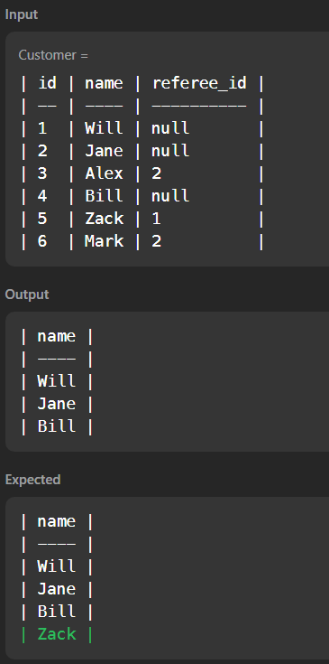

## SQL - 'null'

- Leetcode 584.

Leetcode에서 간단한 문제를 풀다가, 갑자기 의아한 결과를 얻는 경험을 했다.

문제는, 주어진 테이블에서 refer 된 적이 없는(null)인 사람의 이름을 찾는 것이었다.

하지만 아래와 같이 하면  정말 null인 사람만 얻는다.

```mysql
-- 입력한 코드
select name
from Customer
where referee_id is null;
```




> 이렇게 제출하면 틀린 답이 나온다.


한 프로의 답변에 의하면, null에 문제가 있을 땐, 간단한 경우에는 '거짓이 아닙니다' 를 이용하면 원하는 결과를 얻을 수 있는 경우가 많다고 한다.

(null logic이 어떻게 돌아가는지 알아두면 좋겠는데... 정보가 없다...)

```mysql
-- Naive attempt
select name from customer where referee_id != 2; -- 틀린 답이다.

-- Corrected example
select name from customer where referee_id != 2 is not false; -- 정답
```

