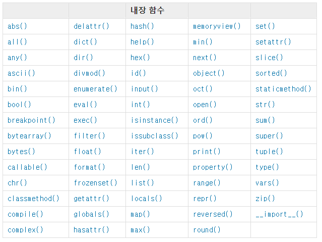

# 1. 23

text 분석을 위한 사이트

1) bit.do/shakespeare_txt => 세잌스피어 텍스트파일.


그럼, 우리가 이 사이트의 텍스트를 사용하기 위해서는 어떻게 해야할까?

# 1. Function

**Abstract**

> 함수는 결국 문제해결을 용이하게하고 complexity를 낮춰주는 역할을 한다.
>
> 바닥까지 알지 못해도 이를 잘 사용하는 것이 바로 함수의 힘.
>
> 인풋과 아웃풋을 통해 세상을 추상화(요약)하는 것이 
>
> 프로그래밍을 통해 나아가고자 하는 방향이다.


## 1-1. Using open_txt in Jupyter-notebook

- 보통은 우리가 requests를 사용했지만, 사실 그 하위에 있는 urllib을 사용하고 있던 것.


```python
from urllib.request import urlopen

shakespeare = urlopen('https://gist.githubusercontent.com/hphk-john/9b30d71a66e7de312a75fbd31c81c8ad/raw/9ebbe8e083997458d288d057330f4e2cc8089380/shakespear.txt')
# 여기서는 bit.do/shakespeare_txt 를 읽어보자

## 1) 총 텍스트의 길이
print(len(shakespeare.read().decode())) ## 먼저 읽은 후, decode를 해줘야 한다. 

## 2) word의 수
word =  shakespeare.read().decode().split()
print(len(word))

## 3) 최빈 단어 출력
from collections import Counter
Counter(word).most_common(1)
```

### 함수를 사용하면 복잡한 내부 구조를 몰라도 잘 뽑아올 수 있다.

### 이 모든 걸 가능케 하는 것이 바로 `함수의 힘`

- divde & conquer => Abstact (복잡도_complextity를 낮추기 위해!)
- abstract? => 추상화 (다른 표현으로 `요약`)


## 1-2. Built-in-Functions

파이썬에서 따로 import해오지 않아도 되는 함수들로, 사용법을 알아두면 여러모로 편하다.





- 이름으로 쓸 수 없는 것들

1) keyword

```python
## keyword를 확인하는 방법
import keyword

keyword.kwlist
```

2) built-in-function

```python
## 내장함수 확인하는 방법
__builtin__
```


## 1-3. 함수를 만들어 사용하기

### 	1) function_name.\_\_doc\_\_

- 함수를 사용하다 보면 우리는 어떤 인자값을 넣어야되는지 모를 때가 많다.
- 함수는 멀티라인 커맨드(`'''`)을 이용해서 주석을 넣을 수 있는데 
- 다큐먼트를 볼 수 있다.

```python
## 예시

def cylinder(r, h):
        '''
    cylinder() 함수는 원기둥의 부피를 구해주는 함수입니다.
    인자로는 반지름(r)과 높이(h)를 받게 됩니다.
    cylinder(반지름, 높이) 형태로 활용되게 됩니다.
    '''
    return 3.14 * r ** 2 * h
```

### 	doc 확인

```python
print(cylinder.__doc__)
>>
    cylinder() 함수는 원기둥의 부피를 구해주는 함수입니다.
    인자로는 반지름(r)과 높이(h)를 받게 됩니다.
    cylinder(반지름, 높이) 형태로 활용되게 됩니다.
```


### 	2) default argument value 설정

- 함수가 호출될 때 기본값을 설정하여, 인자값을 받지 않아도 기본 값으로 출력을 가능하게끔 한다.

```python
## 이름을 넣지 않아도 길동으로 출력이 된다.
def greeting(name = '길동'):
    print(f'안녕, {name}!')
    
greeting()
```


### 	3) positional argument

- 보통 인자값은 받는 위치에 따라 어떤 인자로 사용할지를 결정한다.

my_sum이라는 함수 안에, a, b라는 파라미터를 받는다고 하자.

그럼, 여기서 `a or b`만 default값을 설정한다면 어떻게될까?

```python
## error-1
def my_sum(a=0, b):
    return a+b

print(my_sum(2, 2))

>> SyntaxError: non-default argument follows default argument
```

- **단, 기본 인자 이후에 기본 값이 없는 인자를 사용할 수는 없습니다.**

즉, 인자값을 사용할 때는 뒤에서부터 채워나가야 한다.

```python
## error-2
def my_sum(a=0, b):
    return a+b

print(my_sum(2))

>> SyntaxError: non-default argument follows default argument
```

- **마찬가지로 들어갈 값을 찾지 못합니다.**


### 	4) keyword argument

- 그동안 사실 플라스크 서버를 만들면서 우리가 사용했던 것들 안에 답이 있다.

> chatbot practice

```python
import requests

headers = {
    'X-naver' : xxx
}

data = {
    'text': '번역할 말'
}

requests.post('url', header=header, data = data)
```

- 함수를 만들었을 때의 사용도 마찬가지이다. 우리가 이름을 설정해서 보내면 그 이름을 그대로 받아서 사용한다.

```python
def greeting(age, name = 'john'):
    return f'{name}은 {age}입니다.'

greeting(name = 'jong', age = '28')
#이렇게 적으면 인자의 순서는 달라도 원하는 출력값을 얻을 수 있다. (위치에 상관 없이!!!@@)
```


### 	5) 가변 인자 활용하기(\**args, \*arg)

- 지금까지의 함수들은 이름을 그대로 사용해야했다면, 이 인자들은 이름을 바꿔서 사용할 수 있다.

>  ex) 자주 쓰는 함수 print()
>
> print(*objects, sep='', end='\n', file=sys.stdout, flush=False)

print(name) 과 같이, 함수를 사용할 때 우리는 변할 수 있는 값들을 자주 사용했다.

- 개수가 정해지지 않은 임의의 인자를 받기 위해서는 *args 를사용한다.
- 가변인자는 `tuple` 형태로 처리가 되며, 매개변수에 `*(asterisk)` 로 표현한다.

---

​	**활용법**

```python
def func(*trash): ## 항상 마지막에 위치해야 한다!!
    return trash

func('hi', 'my','name','is','trash') 
> ('hi', 'my', 'name', 'is', 'trash') ## 하나의 튜플로 반환

# *args: 임의의 개수의 위치인자를 받음을 의미
# 보통, 이 가변인자 리스트는 형식 인자 목록의 마지막에 옵니다.
```


```python
def my_dict(**kwargs): # key word argument
    return kwargs

my_dict(한국어 ='안녕', 영어='hello')

# 즉 키워드와 함께 저장하고싶을 때 (마치 딕셔너리처럼) **로 사용한다.
```


```python
def my_dict(**kwargs):
    """
    dict형태로 print하기
    """ ## doc string을 작성할 때에는 쌍따옴표를 더 많이쓴다.
        ## 왜냐면 multiline 주석 사용할 때 안에 쌍따옴표를 사용할 수 있기 때문에!
    
    result = []
    for key, val in kwargs.items():
        result.append(f'{key}: {val}')
    return ', '.join(result) ## 이렇게 딕셔너리 형태로 

my_dict(한국어= '안녕', 영어='hello', 독일어='Guten Tag')
```


### 6) 패킹과 언패킹

말 그대로, 

패킹: 감싸는 것/ 언패킹: 꺼내는 것을 의미한다

```python
## unpacking 예시
# 이미 우리가 사용하고 있던 것이었다!

(x, y) = (1, 2)
x, y = 1, 2

# 리스트도 사용이 가능하다
args = [3, 6, 9]
[x, y, z] = args

print(x,y,z)

##뿐만 아니라 대부분의 시퀀스형 자료형은 전부 가능하다.
```


```python
# 다음과 같이 사용할 수도 있습니다.
args = [1, 46]
range(*args) # range(1, 46)
```

### 패킹에서는 `*`, 언패킹 역시 `*`로 표현하는데,[¶](http://localhost:8888/notebooks/python/03_function.ipynb#패킹에서는-*,-언패킹-역시-*로-표현하는데,)

### 그저 상황에 따라 달라지는 것 뿐이다.

원래 리스트인 [1, 46] => *[1, 46] => 1, 46 으로 풀려서 나오게 된다.


