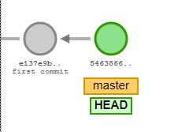
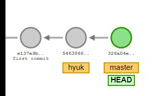
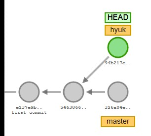

# Git Branch

## 1. 깃랩 사용 수칙
공동 작업을 하기 위해서는 어떻게 해야할까?
깃은 여러 사람의 코드 관리를 수월하게 하기 위해 multi channel운영을 가능하게 한다.
깃의 사용 모습을 눕혀보면 나무의 모습과 같은데,  
각 부분으로 갈라지는 특징들 때문에 `branch` 라고 부른다.


테스트를 하고 나면 push 를 할텐데, 그 상황에서도 실험을 많이 하고 반려/반영 가능하다.
우아한형제들 기술블로그에서 이를 참고할 수 있다.

http://woowabros.github.io/experience/2017/10/30/baemin-mobile-git-branch-strategy.html


### 1) 브랜치는 일회용으로, 한 번 사용했다면 삭제해야한다.  <가장 중요!!>
### 2) Merge는 항상 master를 기준으로, 피브랜치를 합친다.
### 3) Merge를 하기 전, 항상 work tree를 clean한 상태로 유지한다.

`git push origin master`   
`origin` => 주소  
`master` => 브랜치  

## 2. Git 명령어

### 1) 브랜치 목록 보기
- git branch

### 2) 브랜치 생성 삭제
- git branch (name) => 새로운 브랜치 생성
- git switch (branch_name) => 브랜치 이동
- git checkout
- git branch -m (branch_name) => 마스터 없어지고 이름만 바뀜
- git checkout -b (brunch_name) = > 브랜치 생성 & 이동
- git switch -c (brunch_name) => 브랜치 생성 & 이동
- git branch -d (branch_name) => 브랜치 삭제

### 3) 로그 확인 및 버전
- git log --oneline => 모든 로그 확인
- git reset HEAD^ => 이전 버전으로 되돌리기


## 3. Git Merge
브랜치를 만드는 주된 목적은 "안전한 버전 컨트롤" 을 위해서.  
각 브랜치에서 파일을 수정했을 때 어떻게 변하는지 알아보자.

-> 시각화 사이트: https://git-school.github.io/visualizing-git/


```bash
## [master]
$ git switch master
$ touch a.txt       # 텍스트파일 생성
$ git add a.txt
$ git commit -m "Add a.txt"

## [hyuk]
$ git branch hyuk
$ touch b.txt
$ git add b.txt
$ git commit -m "Add b.txt"
```

`$ls`
> master : a.txt  
> hyuk : b. txt


  

- first commit  & second commit after branching  

  

-  Branch commit


### 1) 변경사항이 다른 파일에 대한 머지

```bash
## [master]
$ git merge hyuk

```

https://git-school.github.io/visualizing-git/

2) 동일한 파일을 합치려고 할 때... 같은 파일로 작업했다면 어떻게할까?
==> 에러를 발생시키며 우리한테 역으로 물어본다. 현재 작업 위치와 바뀔작업 위치. 어느거로 고를래?

즉 마스터브랜치에서 작업 => (1 -> 2)
   피브랜치에서 작업 => (1 -> 3)

   여기서 2와 3의 작업이 달라졌기 때문에 이런 경우 에러가 발생한다.
   깃 시나리오대로 한번 다 해보자.

