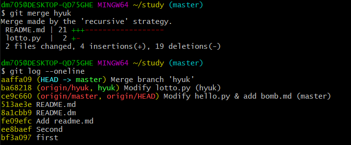
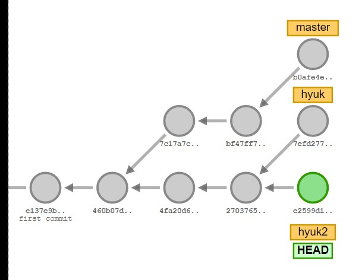
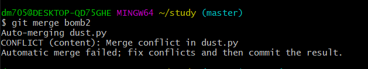
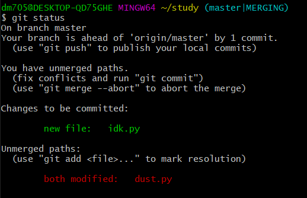
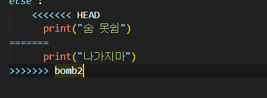
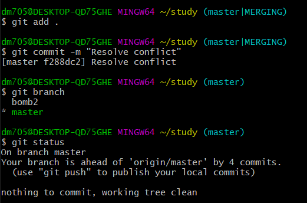
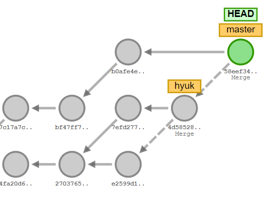
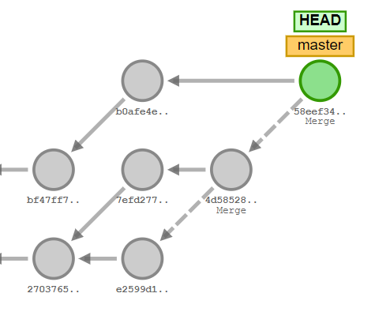

# Git Branch

## 1. 깃랩 사용 수칙
공동 작업을 하기 위해서는 어떻게 해야할까?
깃은 여러 사람의 코드 관리를 수월하게 하기 위해 multi channel운영을 가능하게 한다.
깃의 사용 모습을 눕혀보면 나무의 모습과 같은데,  
각 부분으로 갈라지는 특징들 때문에 `branch` 라고 부른다.


테스트를 하고 나면 push 를 할텐데, 그 상황에서도 실험을 많이 하고 반려/반영 가능하다.
우아한형제들 기술블로그에서 이를 참고할 수 있다.

http://woowabros.github.io/experience/2017/10/30/baemin-mobile-git-branch-strategy.html


### 1) 브랜치는 일회용으로, 한 번 사용했다면 삭제해야한다.  <가장 중요!!>
### 2) Merge는 항상 master를 기준으로, 피브랜치를 합친다.
### 3) Merge를 하기 전, 항상 work tree를 clean한 상태로 유지한다.

`git push origin master`   
`origin` => 주소  
`master` => 브랜치  

## 2. Git 명령어

### 1) 브랜치 목록 보기
- git branch

### 2) 브랜치 생성 삭제
- git branch (name) => 새로운 브랜치 생성
- git switch (branch_name) => 브랜치 이동
- git checkout
- git branch -m (branch_name) => 마스터 없어지고 이름만 바뀜
- git checkout -b (brunch_name) = > 브랜치 생성 & 이동
- git switch -c (brunch_name) => 브랜치 생성 & 이동
- git branch -d (branch_name) => 브랜치 삭제

### 3) 로그 확인 및 버전
- git log --oneline => 모든 로그 확인
- git reset HEAD^ => 이전 버전으로 되돌리기


## 3. Git Merge
브랜치를 만드는 주된 목적은 "안전한 버전 컨트롤" 을 위해서.  
각 브랜치에서 파일을 수정했을 때 어떻게 변하는지 알아보자.

-> 시각화 사이트: https://git-school.github.io/visualizing-git/


```bash
## [master]
$ git switch master
$ touch a.txt       # 텍스트파일 생성
$ git add a.txt
$ git commit -m "Add a.txt"

## [hyuk]
$ git branch hyuk
$ touch b.txt
$ git add b.txt
$ git commit -m "Add b.txt"
```

`$ls`
> master : a.txt  
> hyuk : b. txt


  

- first commit  & second commit after branching  

  

-  Branch commit


### 1) 변경사항이 다른 파일에 대한 머지

```bash
## [hyuk -> master]
$ git merge hyuk
```
`$ ls`
> (master)   
> a.txt / b.txt
> (hyuk)  
> a.txt / d.txt
>
> => (master) a.txt / b.txt / d.txt

원래 파일에서 변경된 사항이 없는 경우, 바뀐 점만 파악해서 합쳐준다.


[최상단]  
=> Merge made by the 'recursive' strategy   
[하단]  
=> Merge branch 'hyuk'  >> ~ commit message ~

**자동으로** 수정할 부분만 찾아준 모습.


### 2) 동일한 파일을 작업했을 때의 머지
(1) 작업을 공동으로 진행하면 여러 개의 브랜치가 생길 수 있다.  
  

(2) 여러 번의 commit, merge를 진행한다.


--> merge한 이후 hyuk2 branch를 삭제한 모습.

(2-1) **문제 발생**

   

같은 파일에 대하여 작업을 한 후 merge => `conflict` 발생


#
심지어 브랜치에서도 `(master|MERGING)` 이라는 이름으로,  
merge conflict가 발생했음을 알려준다.




--- 
  

### ▲▲▲▲▲▲▲▲▲▲▲▲▲▲▲▲▲▲▲▲▲▲▲▲▲▲
###  vs code에서 나오는 결과창, 여기서 수정해주면 된다.
---
### (2-2) Resolve Conflict 


수정 후 브랜치 이름에서 `MERGING` 이 사라졌음을 확인할 수 있고

### 3) After Merge  

#### (1) X ----- 잘못된 마무리 예시

  

~~좋지못한마무리~~   

## ** 브랜치는 일회용이다 **
머지가 끝난 이후에는 git branch -d (branch_name) 으로 지워주자.

--- 

#### (2) O ------- Job Complete    



모범적인 모습


### 4) Git visualize helper 

https://git-school.github.io/visualizing-git/

깃은 터뜨리면서 배우는 것이라고는 하나,
가능하다면 그냥 유지시키는게 좋지 않을까.

위의 시각화 도움 사이트를 사용하여 사전예방을 해보자.  

이 밖에도 깃의 유용한 기능은 넘치고 넘쳤다.  
앞으로도 자주 쓰면서 더욱 잘 알아보도록 하자.

---

##  세 줄 요 약
## 1) Branch로 작업하고 Master에서 합침
## 2) Branch - 여러 시간대의 버전 컨트롤이 가능함.
## 3) Merge 이후 => Delete/Destroy branch
--- 