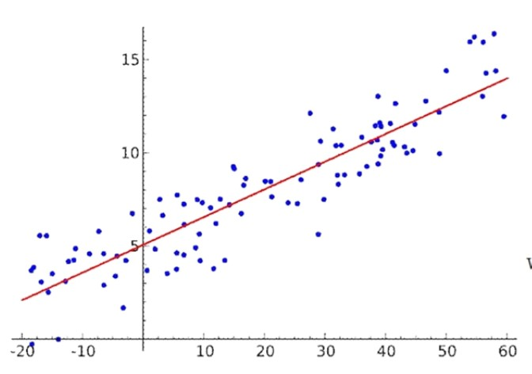
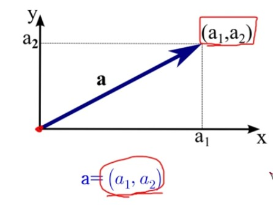
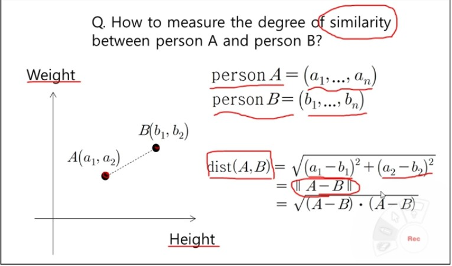
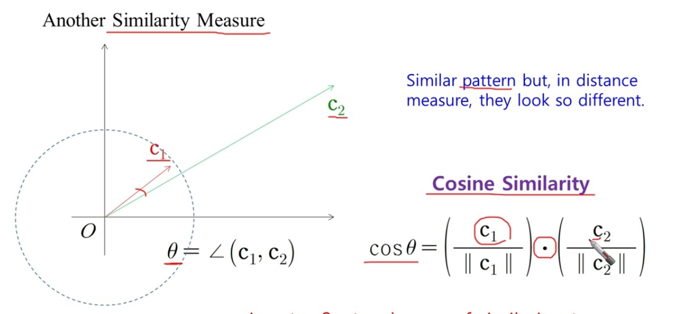
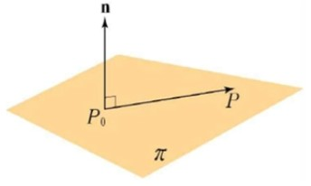

# 선형대수 1장.


## 1. 선형대수란?

과학에는 가설/실험  + `계산` 이라는 새로운 영역이 들어옴

- 수치적인 방법으로 접근하여 신뢰성을 높이는 것을 목표로 함

선형대수에서 `수치선형대수` 라고 부르는 것이 이와 가장 유사하며, 주로 `행렬`을 통해 계산한다.

> 가장 믿을만한 계산 방법을 제공하는 것이 목표


### 선형대수의 기본적인 문제들

- 1) Linear System of Eqs : 선형 연립방정식의 풀이.

- 2)  Least Squares Problem : 최소제곱 문제(선형회귀 문제와 연결된다.)

  ​	(유사도_Similarity) Ax ~ b와의 거리를 구하는 문제

- 3)  Eigenvalue Problem : 동위값(고유값) 문제 _ 정사형 문제에서만 적용 가능하다.

- 4) Singular Value Decomposition: 특이값 분해

  행렬을 실제로 활용하는 것 중 가장 많이 쓰이는 것이 SVD이며, 

  행렬에 대해 관심있는 정보 역시 SVD에 많다.


**본질적으로는 모두 (1)번 문제에 귀결되지만, 그를 위해 하위 항목들을 이해하는 것이 중요**


### (1) Linear Regression

y = b + mx 라는 선을 그었을 때,

각각의 좌표값으로부터의 **거리가 최소가 되도록 값을 조정** 이 목표이다..




### (2) Pricipal Component Analysis(PCA)

> 비지도학습(Unsupervised Learning)

주성분 분석(PCA)은 라벨이 없는 데이터를 통한 비지도학습(Unsupervised Learning)에서 **고차원 데이터를 더 낮은 차원으로 축소하는 대표적인 방법** 중 하나.

 X: centerd data matrix of n x p size

> 공분산행렬의 고유값과 고유벡터를 계산하는 문제를 주로 다루는데, 이 부분은 나중에 다룸

확장된 개념으로는 LDA(Linear Discriminant Analysis)가 있다. 형태가 비슷하지만 일반화된 고유값과 고유벡터를 사용한다는 차이가 있다.


### (3) Support Vector Machine(SVM)

> 지도학습(Supervised Learning)

이미 라벨링을 해놓은 데이터를 +, -으로 나누는 기준선을 긋고, margin을 얼마나 설정.

이 때, 새로운 데이터가 들어왔을 때 어떤 class에 해당하는지를 판단하는 방법이다.


>  그 외에 로지스틱 회귀, 퍼셉트론, 멀티 디멘셔널 스케일링 등이 있지만 나중에 알아가보도록 하자.


## 1.1 벡터(Vector)

- 스칼라(scalar):  크기 (길이, 넓이, 질량, 온도)

- 벡터(vector): 크기 + 방향 (속도, 위치이동, 힘)

  - 벡터는 크기와 방향을 갖는 유향선분 - 화살표로 표현한다 (→)

  - **크기와 방향이 같으면 모두 같은 벡터**라고 여기고, 시작점 끝점은 중요시 보지 않는다.

  >  								
  >
  > ​				[원점 기준으로 a1, a2로 가는 벡터 성분표기법]


- [N차원 벡터(Tuple) : n-dimensional vector ]

  - X = (x1, x2, x3.... xn) == [x1, x2, .... xn]

  - 열벡터 표기를 더 많이 쓴다.

    x1 ~ xn => X의 성분

    Y = (y1, y2, y3.... yn)에서 모든 xi = yi일 때 ==> X = Y 라고 표기한다.

    n차원 벡터들이 모여 matrix(행렬)이 됨.

- [벡터 합과 스칼라배]

- x + y => 시점을 일치시켰을 때 X만큼 이동한 후, y만큼 이동하는 느낌...

- kX  = [kx1, kx2 ... kxn], 모든 원소에 k배수를 해준 것.

- 크기가 0인 벡터 == 영벡터(zero vector) 라고 부르고, 0 으로 표기함.

> 모든 벡터연산은 덧셈 / 스칼라곱셈에 닫혀있고 교환법칙 결합법칙이 성립함.


## 1.2 내적

### (1) X의 노름(norm/length/magnitude) - 이름이 많다.

`||X||` =  **sqrt((x1^2 + x2^2 + x3^2...xn^2))**

> 원점에서부터 P(x1, x2, ...xn)까지의 거리로 정의됨을 알 수 있다.

두 데이터간의 거리 = 유사한 정도(simirality)로 해석이 가능하다.



결국 거리를 구하는 방법 == norm

- **피타고라스의 정리**에 의해 

  **c^2 = a^2 + b^2 - 2ab*cos@** ----- 1

  **a.b = `||X||`  `||Y||` *cos@** ------2

- **코시 슈바르츠 정리**에 의해

  **|x.y| <= `||X||` `||Y||`** --- 3

  3이 성립한다면, 아래도 성립한다. (삼각정리)

  **|| x + y ||  <=  ||x|| + ||y|| ** --- 가장 긴 변의 길이는 다른 두 변의 길이의 합보다 작거나 같다.

- **직교와 평행**

  `x.y = 0`  => 직교

  `x = ky` => 평행


### (2) 유클리드 내적(거리) & 코사인 유사도(상관관계)

> 위에서 설명한 내용들을 코드로 나타낸 것. 

```python
## Euclidean inner product

a = vector([2, -1, 3, 2])
b = vector([3, 2, 1, -4])
print(f"a = {a}")  ## fprint -> python 3.X 버전 이상 사용 가능
print(f"b = {b}")
print()
print(f"{a.inner_product(b)}") # 내적_inner product, 모든 원소 

-----------------
>> a = (2, -1, 3, 2)
>> b = (3, 2, 1, -4)
>>
>>-1  ## x'y = x1*y1 + x2*y2 + x3*y3 + x4*y4
```


### 코사인 유사도(Cosine Similarity)

데이터간의 크기만으로 비교하는 것은 옳지 못한 접근법이다.

데이터간의 상관관계는 거리뿐만 아니라 각도의 차이로도 볼 수 있다. 



norm 1) 원점 기준으로 다이아몬드 형태로 표현됨

norm 2) 원점 기준으로 원형으로 표현

...

norm inf) 정사각형 모향에 가까워짐. 가장 큰 원이라고 생각하면 됨.

> 마찬가지로 코시-슈바르츠 / 삼각부등식이 성립한다.


## 1.3 정사영  --- ★★ 중요 ★★

**선형회귀, 최소제곱합을 이해하는 데 기초 **가 되므로 자세히 보자

### 1) 정사영

두 개의 벡터 x, y가 있을 때, 수선의 발을 내렸을 때 만들어지는 그림자 라고 볼 수 있다.

```python
"""
# x위로 y 정사영(projection of y onto x) 
"""

# # x = OQ(→)
# # y = OP(→)
# # S => 점 P에서 OQ에 내린 수선의 발

      P
    / | 
   /  | (w = y-p)
  /   |
 /____|____ Q
O (p) S (x) 

```

- 1) `proj xY` = p (OS)
- 2) `w = SP(→) = y - p`
  - i) w => x 에 직교인 y의 벡터성분 / vector component
  - ii) 따라서 `y = p + w`
-  3) p는 x에 평행하므로 `p = tx`
- 4) y-p는 x에 직교하므로 `x'(y-p) = 0`
  - == `x'y -  x'p`
  - == `x'y - tx'x`
  - 따라서) `x'y = tx'x    `
  - `t = y'x` / `||x||^2`

~~근데 이것도 결국 유클리드 내적 거리계산 아닌가..?~~


> 예시 코드

```python
x = vector([2, -1, 3])
y = vector([4, -1, 2])
yx = y.inner_product(x) 
xx = x.inner_product(x) 
p = yx/xx*x # 벡터의 정사영
w = y - p # 벡터 x에 직교인 y의 벡터 성분 w
# --------
# x, y, p, w순서로 print

> x = (2, -1, 3)
> y = (4, -1, 2)
>
> p = (15/7, -15/14, 45/14)
> w = (13/7, 1/14, -17/14)
```


### 2) 평면의 방정식: 법선벡터와 한 점

법선 벡터(normal vector)에 수직인 벡터들이 이루는 평면 => PI

> 1) P (x0, y0, z0)
>
>  2) n = (a, b, c)  
>
> n ' (P0,P)  = 0 // 수직하기 때문에.

즉,

P(x,y,z) ' N = 0  --> 무수히 많은 수직평면들과 수직할 때

> ax + by + cz - (ax0 + by0 + cy0) = 0
>
> a(x-x0) + b(y-y0) + c(z-z0) = 0

P0를 지나고 법선벡터 n을 갖는 평면의 point-normal 방정식은

`ax + by + cz = d (d = ax0 + by0 + cy0)` 으로 나타낼 수 있다.



> 예시 코드를 통해 알아보자

```python
'''
 점 P(3, -1, 2)
 평면 x + 3y -2z - 6 = 0
 -- 거리 D를 구하기
'''
v = vector([3, -1, 2]) # 점 P
n = vector([1, 3, -2]) # 평면 n
d = -6
vn = v.inner_product(n) # v와 n의 내적 / ax0 + by0 + cy0
nn = n.norm() # base_norm == 2 (Euclidean D)/ sqrt(a^2 + b^2 + c^2)

Dist = abs(vn+d)/nn # 점과 평면사이의 거리 D 

## 출력 생략
```


### keywords

>벡터, 스칼라
>
>내적
>
>노름, 거리
>
>정사영
>
>평면의 법선 (point-normal)
>
>코시-슈바르츠, 삼각부등식

​	