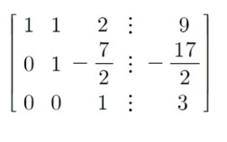

# 2. 선형연립방정식

## 2.1 선형연립방정식 

> 미지수 x1, x2, .... xn 에 관한 유한개의 선형방정식의 모임
>
> > 미지수에 관해 1차식으로 정리된 식을 일차선형방정식이라 하고, 두 개 이상이 모일 경우 선형연립방정식이라고 부른다.

### (1) 만일 상수항이 모두 0일 경우, 동차선형연립방정식 이라 한다.


### (2) 연립방정식의 해집합 -> 연립방정식을 만족하는 (s1, s2, ...sn)의 집합

- 일반적으로, 선형연립방정식은 다음 중 하나만을 만족한다.
  1. 유일한 해를 갖는다. (교차)
  2. 무수히 많은 해를 갖는다. (동일)
  3. 해를 갖지 않는다. (평행 - inconsistent한 선형연립방정식)
  4. 

### (3) A = B (동등, equal)

 A의 모든 성분, B의 모든 성분에 대하여 a_ij == b_ij 일 때, A=B 로 정의한다.

### (4) 행렬의 곱(product) - 외적

- A_(m by n) x B_(n by k) 처럼 앞 행렬의 n, 뒤 행렬의n이 같아야만 계산 가능하다.

### (5) 첨가행렬 (augmented matrix)

- Ax = b의 형태를 만든다

- `연립일차방정식`과 같아지는 결과라고 볼 수 있다

  > a11x1 + a12x2 + ... + a1nxn = b1
  >
  > a21x1 + a21x2 + ... + a2nxn = b2 
  >
  > ​					...
  >
  > am1x1 + am1x2 + ... + amnxn = bm

  A => M by N

  X = > N by 1

  B = M by 1

여기서 더 나아가 [A:b] = [a11 a12 ... a1n : b1] 이런식으로 표현할 수 있고 `첨가행렬`이라 부른다.

> 즉 x 행벡터가 생략된 일차연립방정식 `[상수계수|상수항]` 조합이라고 볼 수 있다.

```python
# 3x3 행렬
A = matrix([[
    [1, 1, 2],
    [2, 4, -3],
    [3, 6, -5],
]])
# 상수항 벡터
b = vector([9, 1, 0]) 

# 첨가행렬
# A.augment(b, subdivide = True)
print(A.augment(b)) 
# -----------------------------
> [ 1 1 2 9 ]
> [ 2 4 -3 1 ]
> [ 3 6 -5 0 ]
```


## 2.2 Gauss / Gauss-Jordan 소거법

- 선형연립방정식의 풀이 : 소거법

  > 미지수가 여러 개인 것을 단순화해나가는 과정
  >
  > 보통 고등학교 때 풀던 연립방정식처럼 차수를 줄여나간다.

- 위의 소거법에서 행한 연산: 선형연립방정식의 해집합을 바꾸지 않는다.

- ex)

  > 2x + 3y = 1
  >
  > x - 2y = 4
  >
  > -----------------------
  >
  > 1) kRi, 실수배곱
  >
  > 2x + 3y = 1
  >
  > 2x - 4y = 8
  >
  > -------------------------
  >
  > 2) Ri <-> Rj, 교환
  >
  > 2x + 3y = 1
  >
  > ​		 7y = -7 ( y = -1)
  >
  > ---
  >
  > 3) kRi + Rj, y배곱을 위에 더해줌.
  >
  > 2x + 3y = 2x -3 = 1 
  >
  > => 2x = 4

  1. 두 식을 교환한다.
  2. 한 식에 0 이 아닌 실수를 곱한다.
  3. 한 식에 0 이 아닌 실수배를 하여 다른 식에 더한다.

  이를 **기본행 연산(ERO, Elementary Row Operations)**이라 한다.

- 이 소거법의 목적은 결국 `A를 단위행렬처럼` 만드는 것이다.

### (2) 행 사다리꼴(row echelon form, REF)

m by n 행렬 E가 다음 3가지 성질을 만족할 때, 행 사다리꼴 이라고 한다.

	1. 성분이 모두 0인 행이 존재하면, 그 행은 맨 아래에 위치
 	2. 각 행에서 처음으로 나타나는 0이 아닌 성분은 1이다. 이때 이 1을 그 행의 선행선분(leading entry, leading 1)이라고 한다.
 	3. i 행과 (i+1)행 모두에 선행성분이 존재하면 (i+1)행의 선행성분은 i행의 선행성분보다 오른쪽에 위치한다.

</img>

또 , 행 사다리꼴 행렬 E가 다음 `4번째 성질을 추가로 만족`하면 기약 행 사다리꼴 (reduced row echelone form, `RREF`) 라고 부른다.

4. 선행성분(leading entry in row)을 포함하는 열의 선행성분 외의 성분은 모두 0이다. (단위행렬 비스무리...)

### (3) 행동치 (row equivalent)

> 행렬 A에 기본행 연산을 시행하여 얻어지는 행렬을 B 라 하면, A 와 B는 `행동치(row equivalent)`

- 기본행 연산 ==> 주어진 행렬을 REF of RREF로 바꾸는 연산

#### 정리) 행동치인 선형연립방정식의 해집합은 같다.

> ex) A의 행동치 a1, B의 행동치 b1
>
> solution(A|B)  == solution(a1|b1) 이다.

- Gauss 소거법: 선형연립방정식의 첨가행렬을 **REF로 변형**하여 푸는 방법.
- Gauss-Jordan 소거법: 선형연립방정식의 첨가행렬을 **RREF로 변형**하여 푸는 방법.

```python
A = matrix([
    [2, 4, 6],
    [2, -1, 1],
    [3, 0, -1],
])
b = vector([18, 8, 3])

print("[A:b] = ")
# 첨가행렬
print(A.augment(b))
print()
print("RREF([A:b]) =")
# RREF
print(A.augment(b).rref())
print()
print("x =", A.solve_right(b))
```


## 3. 실습

```python
# 1) 예시
# ------------------------
A = matrix([
    [2, 1,  1, -2],
    [3, -2, 1, -6],
    [1, 1, -1, -1],
    [5, -1, 2, -8],
])

# 상수항 벡터
b = vector([1, -2, -1, 3])

# 첨가행렬
aug_mat = A.augment(b)

# Gauss-Jordan => RREF 로 변형하여 풀기
mat_RREF = aug_mat.rref()

print(mat_RREF)
'''
[     1      0      0 -17/11      0]
[     0      1      0   9/11      0]
[     0      0      1   3/11      0]
[     0      0      0      0      1]
>> 최하단에 선행성분이 없는데(0행렬), 선행성분이 1이므로 해가 존재하지 않는다. (False)
'''
```